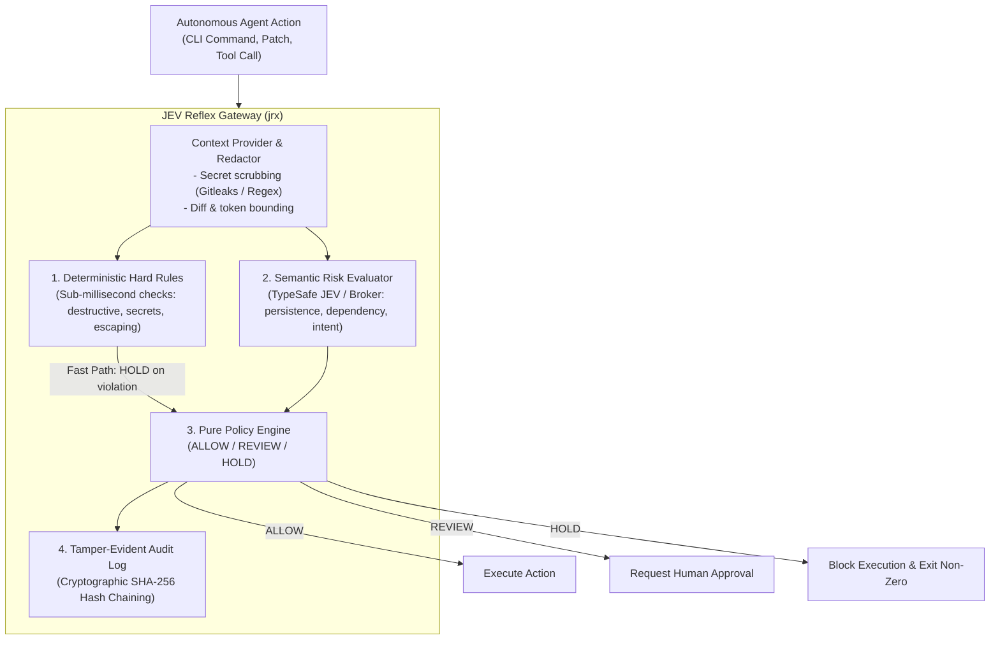

<div align="center">

# JEV Reflex (`jrx`)

**Deterministic Execution Control for Autonomous Coding Agents**

<p align="center">
  <a href="#quickstart">Quickstart</a> •
  <a href="#key-architecture">Architecture</a> •
  <a href="#supported-agents">Supported Agents</a> •
  <a href="#host-broker">Host Broker</a> •
  <a href="#cli-reference">CLI Reference</a> •
  <a href="#configuration">Configuration</a> •
  <a href="#docs">Documentation</a>
</p>

> *“Probabilistic judgment. Deterministic enforcement.”*

</div>

---

## The Problem & The Solution

Coding agents (OpenAI Codex, Claude Code, Antigravity, OpenRouter, Pi, DeepSeek) are **probabilistic**. Semantic evaluation models are probabilistic too. 

Relying solely on LLM self-policing or naive regex blacklists inevitably fails:
* **Unconstrained Agents:** Can execute catastrophic operations (`rm -rf /`, raw disk writes, force branch deletion), leak environment credentials, or escape workspace boundaries.
* **Regex Blacklists Are Fragile:** Static pattern matching cannot grasp intent—such as discerning whether a database migration or dependency update is legitimate or malicious.
* **Model Decisions Fluctuate:** An AI model should never directly own an unmediated execution gate without deterministic guardrails.

### The JEV Reflex Paradigm
**JEV Reflex (`jrx`)** unites **instantaneous local hard rules** with **bounded semantic risk signals** (powered by [TypeSafe JEV](https://typesafe.ai/)). A pure, deterministic policy engine then maps these inputs to a definitive decision: **`ALLOW`**, **`REVIEW`**, or **`HOLD`**.



---

## Quickstart

### 1. Installation

```bash
# Clone the repository
git clone https://github.com/Madhumasa84/jrx.git
cd jrx

# Create and activate virtual environment
python3 -m venv .venv
source .venv/bin/activate

# Install with development dependencies
pip install -e ".[dev]"
```

Both `jrx` and `jev-reflex` CLI commands will be available in your `$PATH`.

### 2. Configure Credentials (BYOK)

JEV Reflex follows a **Bring-Your-Own-Key (BYOK)** model. Provide your TypeSafe API key via environment variable or `.env`:

```bash
cp .env.example .env
# Edit .env with your credentials:
# TYPESAFE_API_KEY="your-typesafe-api-key"
```

### 3. Test in 10 Seconds (Offline Demo Mode)

Evaluate a dangerous command offline without needing an API key:

```bash
$ jrx check --demo --command "rm -rf ./cache"
```

```text
HARD RULES
  known_destructive  TRIGGERED (RECURSIVE_DELETE)

JEV SIGNALS
  destructive        0.98
  irreversible       0.76
  human_review       0.94

POLICY
  known_destructive:RECURSIVE_DELETE

FINAL
  HOLD
```

---

## Policy Decisions & Modes

JEV Reflex calculates deterministic results across 18 semantic risk dimensions:

| Decision | Meaning | Execution Behavior | Example Trigger |
| :--- | :--- | :--- | :--- |
| **`ALLOW`** | Safe to proceed | Executes transparently | `pytest tests/`, `ruff check`, read-only commands |
| **`REVIEW`** | Moderate risk / Ambiguous intent | Pauses for human confirmation | `alembic upgrade`, `pip install`, config mutations |
| **`HOLD`** | Critical hazard detected | **Terminates execution** | `rm -rf /`, `git push --force`, credential export |

### Execution Modes
* **`advisory`** (Default): Emits structured audit warnings and signals without interrupting execution. Ideal for CI observation and baseline calibration.
* **`review`**: Prompts the developer or halts execution whenever a `REVIEW` or `HOLD` condition is triggered.
* **`enforce`**: Strictly blocks `HOLD` actions and treats degraded/unavailable semantic evaluations as fail-closed.

---

## Supported Agent Harnesses

JEV Reflex features native hook adapters for leading coding agent frameworks:

| Agent / Harness | Integration Hook | Adapter Command | Docs |
| :--- | :--- | :--- | :--- |
| **OpenAI Codex CLI** | `.codex/hooks.json` PreToolUse | `jrx codex-hook` | [Guide](docs/harnesses.md#1-openai-codex-cli) |
| **Anthropic Claude Code** | `.claude/settings.json` PreToolUse | `jrx claude-code-hook` | [Guide](docs/harnesses.md#2-anthropic-claude-code) |
| **Google Antigravity** | `.agents/hooks.json` PreToolUse | `jrx antigravity-hook` | [Guide](docs/harnesses.md#3-google-antigravity) |
| **OpenRouter Agent SDK** | Python & TypeScript Lifecycle Hooks | `jrx openrouter-hook` | [Guide](docs/harnesses.md#4-openrouter-agent-sdk) |
| **Pi Coding Agent** | `.pi/extensions/` Extension Event | `jrx pi-hook` | [Guide](docs/harnesses.md#5-pi-agent) |
| **DeepSeek Harness** | `dsh-hooks-codex` Bridge Protocol | `jrx deepseek-hook` | [Guide](docs/harnesses.md#6-deepseek-harness) |
| **Universal Wrapper** | Standard CLI Prefix | `jrx exec --mode enforce -- <cmd>` | [Guide](docs/harnesses.md#7-universal-cli-wrapper-fallback) |

*Full integration instructions and ready-to-copy hook configurations are documented in [docs/harnesses.md](docs/harnesses.md).*

---

## Host Broker Architecture

In enterprise sandbox environments (Docker containers, microVMs, Kubernetes pods), passing raw API keys into the untrusted agent environment violates least privilege.

The **JEV Reflex Host Broker** isolates credentials in the host environment while serving evaluations over a restricted Unix domain socket:

```
┌─────────────────────────────────────────┐         ┌─────────────────────────────────────────┐
│     Untrusted Agent Sandbox / Pod       │         │        Trusted Host Environment         │
│                                         │         │                                         │
│   Agent (Codex / Claude / Custom)       │         │   jrx broker (Background Daemon)        │
│         │                               │         │         │                               │
│         ▼                               │         │         ▼                               │
│   Local Hard Checks                     │  POSIX  │   TypeSafe JEV API Gateway              │
│         │                               │ Socket  │   (TYPESAFE_API_KEY stored on host)     │
│         ▼                               │ (0600)  │         │                               │
│   Unix Socket Client ───────────────────┼─────────┼─────────┘                               │
│   ~/.jev-reflex/reflex.sock             │         │   Prometheus Metrics Server (:9090)     │
└─────────────────────────────────────────┘         └─────────────────────────────────────────┘
```

### Managing the Broker Daemon

```bash
# Start broker in foreground (useful for development & debugging)
jrx broker run

# Start broker as a detached background daemon
jrx broker start

# Query broker health and socket status
jrx broker status --json

# Terminate broker daemon
jrx broker stop
```

---

## Cryptographic Audit Trail & Governance

Every decision evaluated by JEV Reflex is permanently logged to an append-only, SHA-256 hash-chained Merkle ledger.

### Verifying Log Integrity
Detect any unauthorized alteration, sequence reordering, or record deletion:

```bash
$ jrx audit verify
Audit log cryptographic integrity verified: 1042 entries checked (0 errors).
```

### Human Override Tracking
Track authorized manual bypasses for auditing and governance compliance:

```bash
# Authorize an override as a named approver
jrx exec --mode enforce --allow-override --approver "lead-secops" -- terraform apply

# Review audit trail of overrides
jrx audit overrides --since 2026-09-01
```

### Cryptographic Policy Signing
Guarantee that policies cannot be modified by unprivileged local developers:

```bash
# Generate Ed25519 signing keypair
jrx policy keygen --output-dir ~/.jrx/keys

# Sign a policy file
jrx policy sign reflex.yaml --key ~/.jrx/keys/policy_signing.key

# Verify policy authenticity
jrx policy verify reflex.yaml --public-key ~/.jrx/keys/policy_signing.pub
```

---

## CLI Command Reference

| Command | Usage | Description |
| :--- | :--- | :--- |
| `jrx check` | `jrx check --command "<cmd>"` | Analyze proposed action without executing. Supports `--json`, `--task`, `--stdin-diff`. |
| `jrx exec` | `jrx exec --mode enforce -- <cmd>` | Evaluate and execute command safely. Blocks execution on `HOLD`. |
| `jrx compare` | `jrx compare --command "<cmd>"` | Compare deterministic-only rules versus combined JEV semantic evaluation. |
| `jrx stability` | `jrx stability --runs 100 --command "<cmd>"` | Test decision consistency and calculate flip rates over repeated evaluations. |
| `jrx broker` | `jrx broker [run\|start\|stop\|status]` | Manage the host-side semantic daemon and IPC socket. |
| `jrx audit` | `jrx audit [verify\|overrides\|export]` | Audit log verification, override governance, and SIEM exports. |
| `jrx policy` | `jrx policy [sign\|verify\|test\|keygen]` | Policy signing, Ed25519 verification, and golden regression testing. |
| `jrx benchmark` | `jrx benchmark [stability\|live]` | Run automated offline test suites or live TypeSafe API benchmarks. |

---

## Configuration Reference (`reflex.yaml`)

Configure thresholds, hard rules, and evaluation behaviors with `reflex.yaml`:

```yaml
# Execution mode: advisory | review | enforce
mode: advisory

# Decision thresholds (0.0 to 1.0)
thresholds:
  review: 0.70
  hold: 0.90

# Semantic categories that trigger immediate HOLD
hold_on:
  - destructive
  - secret_exposure
  - irreversible
  - prompt_injection
  - wrong_repo
  - fail_open

# Semantic categories that require explicit REVIEW
review_on:
  - security_sensitive
  - concurrency_sensitive
  - persistence_sensitive
  - backwards_compatibility
  - human_review

# JEV Semantic Settings
jev:
  transport: direct      # direct | broker | broker-tls
  socket: ~/.jev-reflex/reflex.sock
  samples: 1             # Number of semantic samples to aggregate
  aggregation: median    # median | mean | max
  api_timeout: 20.0

# Cryptographic Governance
signing:
  require_signature: false
  public_key_path: ~/.jrx/keys/policy_signing.pub

# Human Override Rules
override:
  allow_hold_override: false  # When false, HOLD actions can NEVER be bypassed
```

---

## Production & Container Deployment

### Docker Container
Build and deploy the lightweight, non-root container image:

```bash
docker build -t jrx-broker:latest .

docker run -d \
  --name jrx-broker \
  -e TYPESAFE_API_KEY="your-api-key" \
  -p 9090:9090 \
  jrx-broker:latest
```

### Kubernetes Helm Chart
Deploy the broker into Kubernetes clusters using the included Helm chart:

```bash
# Validate chart
helm lint ./helm/jrx-broker

# Install chart
helm install jrx-broker ./helm/jrx-broker \
  --set env.TYPESAFE_API_KEY="your-api-key" \
  --set service.metrics.port=9090
```

---

## Documentation Index

| Guide | Content |
| :--- | :--- |
| **[System Architecture](docs/architecture.md)** | Deep dive into the 4-stage pipeline, context bounding, and pure policy logic. |
| **[Harness Integrations](docs/harnesses.md)** | Comprehensive setup guides for Codex, Claude Code, Antigravity, OpenRouter, Pi, and DeepSeek. |
| **[Security Architecture](docs/security.md)** | Hard check mechanics, secret redaction engine, Ed25519 signing, and boundary traversal defenses. |
| **[Enterprise Threat Model](docs/threat-model.md)** | Formal security boundaries, 12 attacker personas, and negative security findings. |
| **[Host Broker Daemon](docs/broker.md)** | Unix socket protocol, permissions specification, mTLS transport, and IPC limits. |
| **[Observability & Metrics](docs/observability.md)** | Prometheus metrics exposition (`:9090/metrics`), structured logging, and calibration. |
| **[Benchmark Methodology](docs/live-benchmark.md)** | Empirical stability metrics, decision consistency calculation, and live API test suites. |

---

## Contributing

Contributions, bug reports, and discussions are welcome!

1. Ensure vendor-specific logic remains decoupled in `src/jev_reflex/adapters/`.
2. Maintain zero host pollution—all tests should run in isolated temporary sandboxes.
3. Verify linting and test suites pass:
   ```bash
   make lint
   make test
   ```

---

## License

JEV Reflex is open-source software licensed under the **Apache License 2.0**. See the [LICENSE](LICENSE) file for details.
