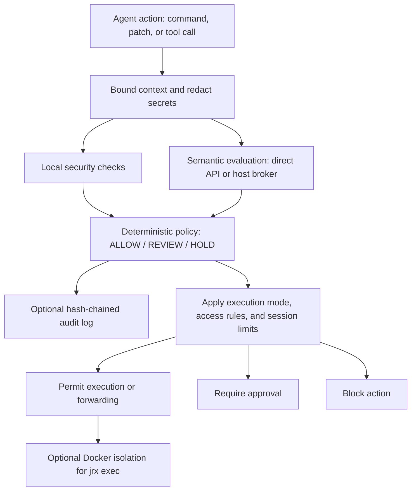
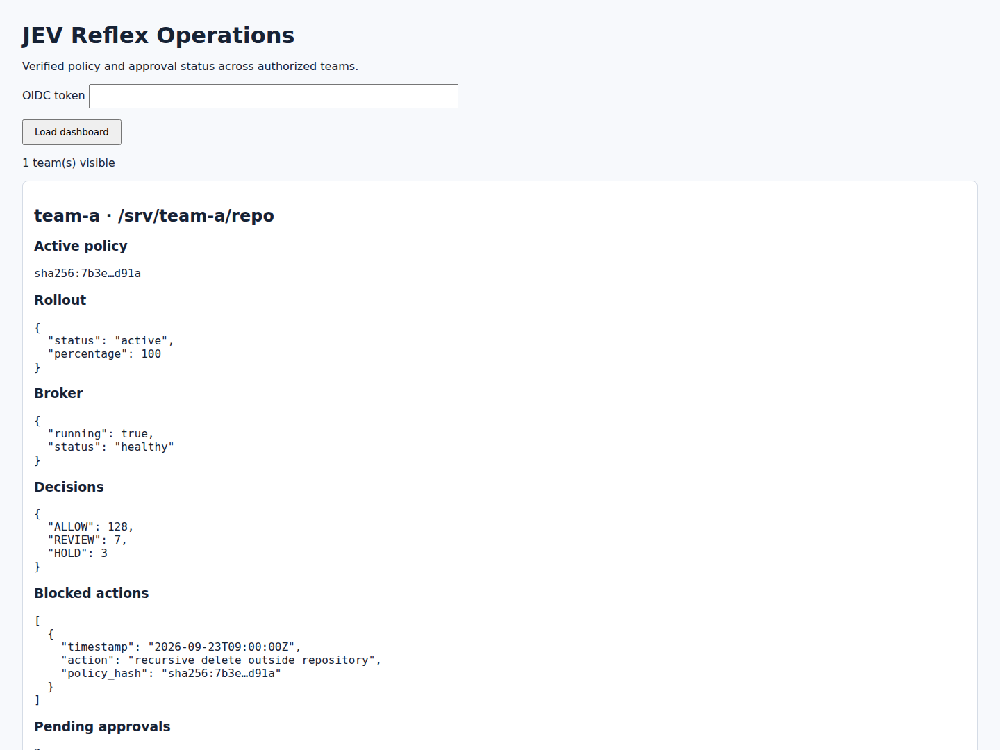

<div align="center">


# JEV Reflex (`jrx`)

**Runtime Policy Enforcement for AI Coding Agents**

[](LICENSE)
[](https://www.python.org/downloads/)
[](https://github.com/astral-sh/ruff)
[](docs/architecture.md)
[](docs/security.md)

<p align="center">
  <a href="#quickstart">Quickstart</a> •
  <a href="#architecture">Architecture</a> •
  <a href="#agent-integrations">Supported Agents</a> •
  <a href="#host-broker-architecture">Host Broker</a> •
  <a href="#verified-identity-and-reviewed-execution">Identity &amp; Approvals</a> •
  <a href="#isolated-command-execution">Isolated Execution</a> •
  <a href="#cli-command-reference">CLI Reference</a> •
  <a href="#configuration-reference-reflexyaml">Configuration</a> •
  <a href="#documentation-index">Documentation</a>
</p>

> *“Probabilistic judgment. Deterministic enforcement.”*

</div>

---

## Overview

JEV Reflex (`jrx`) evaluates proposed commands and tool calls before execution. It combines local security checks with semantic risk signals from [TypeSafe JEV](https://typesafe.ai/), then applies a deterministic policy to return **`ALLOW`**, **`REVIEW`**, or **`HOLD`**. The policy is deterministic for identical inputs; semantic model outputs can vary.

Use it as a CLI wrapper, an agent hook, or a Model Context Protocol (MCP) gateway. Enforcement depends on the configured mode and on routing actions through JRX. An `ALLOW` result is a policy decision, not a guarantee that an action is safe.

| Capability | Implementation |
| :--- | :--- |
| Runtime policy enforcement | Local destructive-command, secret, and repository-boundary checks combined with semantic evaluation. |
| Policy as code | YAML thresholds and rules, Ed25519 signatures, audit replay, staged rollout, and rollback. |
| Identity and approvals | OIDC verification, roles scoped to repositories and environments, and single-use approvals bound to an action. Production requires two independent reviewers. |
| MCP tool authorization | Explicit server/tool allowlists, JSON Schema argument validation, JSON Pointer constraints, and optional upstream schema pins. |
| Session controls | Persistent call and evaluation budgets, reserved spend estimates, time limits, and stop controls. |
| Execution isolation | Opt-in Docker containers with resource limits and either no network or controlled outbound access. |
| Audit and operations | Optional tamper-evident audit logs, Prometheus metrics, and an OIDC-protected operations dashboard. |
| Credential separation | A host broker evaluates requests without exposing the semantic API key to the agent environment. |

## Architecture



See [identity and approvals](#verified-identity-and-reviewed-execution),
[policy rollout](#policy-rollout-and-operations-dashboard), and
[MCP and session controls](#mcp-gateway-and-session-limits) for configuration.

---

## Quickstart

### 1. Installation

```bash
# Clone the repository
git clone https://github.com/Madhumasa84/jrx.git
cd jrx

# Create and activate virtual environment
python3 -m venv .venv
source .venv/bin/activate

# Install with development dependencies
pip install -e ".[dev]"
```

Both `jrx` and `jev-reflex` CLI commands will be available in your `$PATH`.

### 2. Configure credentials

For live semantic evaluation, provide a TypeSafe API key through the process environment or your secret manager:

```bash
export TYPESAFE_API_KEY="YOUR_TYPESAFE_API_KEY"
```

`.env.example` documents environment settings. JRX does not automatically load a `.env` file. When using the host broker, supply the API key to the broker process.

### 3. Try an offline evaluation

```bash
jrx check --demo --command "rm -rf ./cache"
```

`check` evaluates the proposed action without executing it. Demo mode uses fixture signals and requires no API key; it does not validate live semantic evaluation.

### 4. Choose an execution mode

```bash
jrx exec --mode enforce -- python -m pytest
```

This evaluates the command and runs it when policy permits. Docker isolation is opt-in; see [isolated execution](#isolated-command-execution).

## Policy decisions and modes

The policy combines local findings with 18 semantic risk signals:

| Decision | Meaning |
| :--- | :--- |
| **`ALLOW`** | The evaluated inputs satisfy the configured policy. |
| **`REVIEW`** | The configured review threshold or rule was triggered. |
| **`HOLD`** | A blocking rule or hold threshold was triggered. |

For standard execution without enterprise access controls:

| Mode | Behavior |
| :--- | :--- |
| `advisory` (default) | Reports decisions without blocking execution on policy results. Audit persistence must be enabled separately. |
| `review` | Requires confirmation for `REVIEW` or `HOLD` in the CLI; hooks can deny the action for host review. |
| `enforce` | Blocks `HOLD` by default and fails closed on unavailable or malformed semantic evaluation. A non-degraded `REVIEW` can proceed to the agent host's normal permission system. |

Enforce-mode HOLD overrides require `policy.allow_hold_override: true`. Enterprise access controls and the MCP gateway impose additional authorization requirements, described below.

### Verified identity and reviewed execution

Set `access` in a protected, signed policy to enable OIDC identity checks. The host supplies an RS256 signed ID token in `JRX_ID_TOKEN`; JEV Reflex verifies its signature against the configured HTTPS JWKS endpoint, issuer, audience, expiry, subject, and roles claim. The role rules scope `execute` and `review` to exact repository paths and environments. Keep the token in a trusted host process; an agent that can read the token can act as that identity. The configured environment is authoritative, so a caller cannot label a production action as development.

```yaml
mode: review
access:
  issuer: https://sso.example.com
  audience: jrx
  jwks_uri: https://sso.example.com/keys
  environment: production
  approval_db: /var/lib/jrx/approvals.sqlite3
  approval_ttl_seconds: 900
  production_environments: [production]
  roles_claim: roles
  rules:
    - role: developer
      actions: [execute]
      repositories: [/srv/my-project]
      environments: [production]
    - role: reviewer
      actions: [review]
      repositories: [/srv/my-project]
      environments: [production]
```

For a risky action, the developer requests approval and gives its ID to reviewers. Reviewers inspect `jrx approval pending` and each grants independently. Production requires two distinct reviewers; the requester cannot approve their own action. The approval expires, can be used once, and is bound to the exact command, working directory, Git state, effective policy, environment, and requester. Commands that exceed 1,000 characters or contain text requiring secret redaction cannot be submitted for approval. In enforce mode, an unavailable semantic evaluation blocks execution even with approval.

```bash
jrx approval request --config reflex.yaml --cwd /srv/my-project \
  --environment production --command 'python migrate.py'
jrx approval pending --config reflex.yaml
jrx approval grant APPROVAL_ID --config reflex.yaml
jrx exec --config reflex.yaml --cwd /srv/my-project \
  --environment production --approval-id APPROVAL_ID -- python migrate.py
```

Agent hooks use `JRX_ENVIRONMENT` and `JRX_APPROVAL_ID` from the trusted host. For a shell hook, request approval with `--hook-command` to bind the raw shell command. Enterprise execution refuses demo mode, disabled semantic evaluation, and CLI mode overrides. Hooks fail closed if identity or approval checks fail. Approval requests currently cover shell commands; other tool actions with a REVIEW or HOLD result remain blocked in enterprise mode.

---

## Agent integrations

The repository includes the following adapters and setup guides. Confirm hook support in your installed agent host before enabling enforcement:

| Agent / Harness | Integration Hook | Adapter Command | Docs |
| :--- | :--- | :--- | :--- |
| **OpenAI Codex CLI** | `.codex/hooks.json` PreToolUse | `jrx codex-hook` | [Guide](docs/harnesses.md#1-openai-codex-cli) |
| **Anthropic Claude Code** | `.claude/settings.json` PreToolUse | `jrx claude-code-hook` | [Guide](docs/harnesses.md#2-anthropic-claude-code) |
| **Google Antigravity** | `.agents/hooks.json` PreToolUse | `jrx antigravity-hook` | [Guide](docs/harnesses.md#3-google-antigravity) |
| **OpenRouter Agent SDK** | Python & TypeScript Lifecycle Hooks | `jrx openrouter-hook` | [Guide](docs/harnesses.md#4-openrouter-agent-sdk) |
| **Pi Coding Agent** | `.pi/extensions/` Extension Event | `jrx pi-hook` | [Guide](docs/harnesses.md#5-pi-agent) |
| **DeepSeek Harness** | `dsh-hooks-codex` Bridge Protocol | `jrx deepseek-hook` | [Guide](docs/harnesses.md#6-deepseek-harness) |
| **Universal Wrapper** | Standard CLI Prefix | `jrx exec --mode enforce -- <cmd>` | [Guide](docs/harnesses.md#7-universal-cli-wrapper-fallback) |

*Full integration instructions and ready-to-copy hook configurations are documented in [docs/harnesses.md](docs/harnesses.md).*

---

## Host Broker Architecture

In enterprise sandbox environments (Docker containers, microVMs, Kubernetes pods), passing raw API keys into the untrusted agent environment violates least privilege.

The **JEV Reflex Host Broker** isolates credentials in the host environment while serving evaluations over a restricted Unix domain socket:

```
┌─────────────────────────────────────────┐         ┌─────────────────────────────────────────┐
│     Untrusted Agent Sandbox / Pod       │         │        Trusted Host Environment         │
│                                         │         │                                         │
│   Agent (Codex / Claude / Custom)       │         │   jrx broker (Background Daemon)        │
│         │                               │         │         │                               │
│         ▼                               │         │         ▼                               │
│   Local Hard Checks                     │  POSIX  │   TypeSafe JEV API Gateway              │
│         │                               │ Socket  │   (TYPESAFE_API_KEY stored on host)     │
│         ▼                               │ (0600)  │         │                               │
│   Unix Socket Client ───────────────────┼─────────┼─────────┘                               │
│   ~/.jev-reflex/reflex.sock             │         │   Prometheus Metrics Server (:9090)     │
└─────────────────────────────────────────┘         └─────────────────────────────────────────┘
```

### Managing the Broker Daemon

```bash
# Start broker in foreground (useful for development & debugging)
jrx broker run

# Start broker as a detached background daemon
jrx broker start

# Query broker health and socket status
jrx broker status --json

# Terminate broker daemon
jrx broker stop
```

---

## Tamper-evident audit logs and policy signing

Enable `audit.enabled: true` to persist decisions in a SHA-256 hash-chained audit log. Protect the log storage and retention policy separately.

### Verifying Log Integrity
Verify record hashes and chain continuity. Detecting the loss of an entire log or a valid trailing segment requires a separately trusted checkpoint or retained copy:

```bash
jrx audit verify
```

### Human Override Tracking
Record local CLI overrides with an approver label and justification. The label is self-reported; use OIDC and reviewed approvals when verified identity is required:

```bash
# Review an action interactively and record override details
jrx exec --mode review --approver "lead-secops" \
  --justification "Reviewed migration plan" -- python migrate.py

# Review audit trail of overrides
jrx audit overrides --since 2026-09-01
```

### Cryptographic Policy Signing
Sign policies with Ed25519 to detect changes. Require signature verification through a protected host bootstrap file and keep signing keys outside the agent workspace:

```bash
# Generate Ed25519 signing keypair
jrx policy keygen --output-dir ~/.jrx/keys

# Sign a policy file
jrx policy sign reflex.yaml --key ~/.jrx/keys/policy_signing.key

# Verify policy authenticity
jrx policy verify reflex.yaml --public-key ~/.jrx/keys/policy_signing.pub
```

## Policy rollout and operations dashboard

Policy simulation replays the deterministic findings, semantic signals, risk classification, and degraded state stored in new audit entries. It verifies the audit hash chain first, checks that each entry was evaluated under the baseline policy, and reports every `ALLOW`/`REVIEW`/`HOLD` transition. Older entries lacking replay inputs are counted as skipped. Simulation does not rerun the semantic model or reconstruct a command from its audit summary. Enable `audit.enabled: true` in the policy before collecting rollout evidence.

```bash
jrx policy simulate --audit /var/log/jrx/audit.jsonl \
  --baseline reflex.yaml --candidate proposed.yaml
```

Configure a signed policy source and rollout state in the host bootstrap file (`/etc/jrx/bootstrap.yaml` or `~/.jev-reflex/bootstrap.yaml`). The pinned public key is the **PEM content**, not a path. Keep the state file in a host-controlled directory; JRX writes it with owner-only permissions.

```yaml
require_signature: true
public_key_path: /etc/jrx/policy-signing.pub
rollout_state_path: /var/lib/jrx/policy-rollout.json
policy_source:
  type: https
  uri: https://policies.example.org/reflex.yaml
  pinned_signature_pubkey: |
    -----BEGIN PUBLIC KEY-----
    ...
    -----END PUBLIC KEY-----
```

The fetched candidate must have a valid Ed25519 signature. Staging requires at least one matching replayed decision. By default, it rejects any new `ALLOW` decision; set `--max-new-allows` only after reviewing the simulation. The baseline file must match the active rollout revision. Canary selection hashes the repository scope so the same repository remains in the same cohort at a given percentage.

```bash
jrx policy rollout stage --bootstrap /etc/jrx/bootstrap.yaml \
  --baseline reflex.yaml --audit /var/log/jrx/audit.jsonl
jrx policy rollout promote --bootstrap /etc/jrx/bootstrap.yaml --percent 10
jrx policy rollout status --bootstrap /etc/jrx/bootstrap.yaml
jrx policy rollout promote --bootstrap /etc/jrx/bootstrap.yaml --percent 100
jrx policy rollout rollback --bootstrap /etc/jrx/bootstrap.yaml
```

`rollback` discards an in-progress candidate, or restores the previous fully promoted revision. The host's bootstrap file must be at one of the standard locations for `check`, `exec`, and hooks to select the staged policy. Production rollout operators should keep a copy of the currently active policy to use as the next staging baseline.

The dashboard reads local audit logs, approval databases, rollout state, broker sockets, and Prometheus metrics endpoints for configured teams. It verifies audit integrity before showing decisions. Set an OIDC `view` rule for each repository and run the server on loopback. The browser requests an OIDC token and keeps it only in page memory. Use an authenticated HTTPS proxy for remote access.

```yaml
# dashboard.yaml
access:
  issuer: https://idp.example.org
  audience: jrx
  jwks_uri: https://idp.example.org/.well-known/jwks.json
  environment: dashboard
  rules:
    - role: operations
      actions: [view]
      repositories: [/srv/team-a/repo]
      environments: [dashboard]
sources:
  - team: team-a
    repository: /srv/team-a/repo
    policy_path: /srv/team-a/repo/reflex.yaml
    audit_path: /var/log/jrx/team-a.jsonl
    # Add audit_public_key_path when audit entries are signed.
    # audit_public_key_path: /etc/jrx/audit-signing.pub
    approval_db: /var/lib/jrx/team-a-approvals.sqlite3
    rollout_state_path: /var/lib/jrx/team-a-rollout.json
    broker_socket: /run/jrx/team-a.sock
    metrics_port: 9090
```

```bash
jrx dashboard serve --config dashboard.yaml --port 8080
```



*Operations dashboard shown with sample data.*

This dashboard aggregates sources on the host where it runs. To view multiple hosts, mount their read-only data or run a dashboard per host. Metrics are read from loopback, and the dashboard does not label metrics with repository or user identifiers.

JRX uses its own YAML policy format and exposes broker metrics in Prometheus format. It does not consume OPA bundles.

## MCP gateway and session limits

The MCP gateway wraps a trusted **stdio** MCP server. It passes protocol messages through and checks each `tools/call` request before forwarding it. Server and tool names must be listed exactly in `mcp.tools`; unknown pairs fail closed. `destructive` tools are blocked. `write` tools require a live semantic `ALLOW` result, while `read` tools may use deterministic checks only. The gateway returns denied calls as MCP tool results with `isError: true`, leaving the upstream server untouched. Configure the gateway as the MCP server command in your agent host.

```yaml
# reflex.yaml
mode: enforce
mcp:
  use_jev: true
  timeout_seconds: 30
  tools:
    - {server: data, name: db.read, effect: read}
    - {server: data, name: db.update, effect: write}
    - {server: cloud, name: cloud.delete, effect: destructive}
    - {server: tickets, name: ticket.change, effect: write}
session:
  enabled: true
  path: /var/lib/jrx/sessions.sqlite3
  max_tool_calls: 100
  max_semantic_evaluations: 50
  max_semantic_spend_usd: 5.00
  reserved_cost_per_evaluation_usd: 0.05
  max_elapsed_seconds: 3600
  max_execution_seconds: 300
  max_risky_attempts: 3
```

```bash
# Set JRX_SESSION_ID in the trusted host process for check, exec, and hooks.
export JRX_SESSION_ID=agent-run-123
jrx mcp serve --config reflex.yaml --server data --session-id agent-run-123 \
  -- python -m my_mcp_server
jrx session status agent-run-123 --config reflex.yaml
jrx session stop agent-run-123 --config reflex.yaml
```

The session ID must come from the trusted host and remain fixed for the agent run. The SQLite ledger atomically reserves calls and an operator-configured **upper-bound estimate** before each semantic evaluation. `reserved_spend_usd` is a budget estimate, not provider billing; set `reserved_cost_per_evaluation_usd` above the largest expected evaluation cost. The administrator stop blocks subsequent evaluations and tool calls and terminates a session-managed `jrx exec` process at its next check. A command is also terminated when `max_execution_seconds` elapses. Each repeated `REVIEW`, `HOLD`, or degraded action counts toward `max_risky_attempts`; reaching that limit persistently stops the session, including subsequent calls with different actions. When `access` is configured, `session stop` and `status` require an OIDC rule with `actions: [admin]`, `repositories: ['*']`, and the configured environment.

The gateway checks repository-scoped `execute` permission when `access` is configured. It currently supports stdio MCP servers; Streamable HTTP transport is outside this gateway. Tool rules classify the known upstream tools and should be maintained when that server changes its catalog. The wire behavior follows the MCP [stdio transport](https://modelcontextprotocol.io/specification/2025-06-18/basic/transports) and [tool error](https://modelcontextprotocol.io/specification/2025-06-18/server/tools) conventions.

Tool rules can also pin the accepted argument shape and restrict resource identifiers.
Use JSON Schema with `additionalProperties: false` to reject unreviewed fields, then
use JSON Pointer constraints to limit values such as database or cloud account names:

```yaml
mcp:
  tools:
    - server: data
      name: db.read
      effect: read
      argument_schema:
        type: object
        required: [database, query]
        properties:
          database: {type: string}
          query: {type: string, maxLength: 2000}
        additionalProperties: false
      argument_constraints:
        /database: [development]
```

The gateway rejects mismatched calls before evaluation or forwarding. Schemas may use
local `$ref` references; remote schema references are disabled. See
[MCP argument policy](docs/mcp-argument-policy.md) for supported behavior and optional
SHA-256 pins that detect upstream input-schema changes. Non-finite JSON numbers are
rejected. Pinned tools require a validated catalog; catalog-change notifications revoke
validation until the catalog is checked again, and pins are rechecked before forwarding.

## Isolated command execution

`jrx exec` can run approved commands in an opt-in Docker container with no network by
default, or controlled outbound connections through an exact-host proxy allowlist. It
uses a read-only container root, a writable repository mount, dropped Linux capabilities,
and CPU, memory, PID, temporary storage, and execution time limits. The container
receives no host environment variables. Configure trusted images under `sandbox`; see
the [isolated execution guide](docs/execution-sandbox.md) for its limits and end-to-end test.

```yaml
sandbox:
  enabled: true
  image: "python:3.12-slim@sha256:REPLACE_WITH_VERIFIED_DIGEST"
  # Optional; enables only the listed hostnames and ports.
  # proxy_image: "python:3.12-slim@sha256:REPLACE_WITH_VERIFIED_DIGEST"
  # allowed_hosts: [pypi.org, files.pythonhosted.org]
  # allowed_ports: [443]
  memory_limit: 1g
  cpus: 2
  pids_limit: 256
  tmp_size: 256m
  max_execution_seconds: 300
```

Run it with `jrx exec --config reflex.yaml --cwd /path/to/repository -- python -m pytest`.
The image should include the command's tools and dependencies unless selected outbound
access is configured. Controlled egress requires Docker Engine 28 or newer and a
Python-capable proxy image. Only configured ports are allowed. Private destinations
require explicit CIDRs; loopback, link-local, and multicast destinations are blocked.

The repository mount remains writable and includes files present in that directory,
including ignored files. This option isolates `jrx exec` commands; it does not sandbox
agent hooks or upstream MCP servers.

---

## CLI Command Reference

| Command | Usage | Description |
| :--- | :--- | :--- |
| `jrx check` | `jrx check --command "<cmd>"` | Analyze proposed action without executing. Supports `--json`, `--task`, `--stdin-diff`. |
| `jrx exec` | `jrx exec --mode enforce -- <cmd>` | Evaluate and execute according to mode, access rules, and session limits; optionally use Docker isolation. |
| `jrx approval` | `jrx approval [request\|pending\|grant]` | Request an action-bound approval, show a reviewer's queue, or grant approval. |
| `jrx compare` | `jrx compare --command "<cmd>"` | Compare deterministic-only rules versus combined JEV semantic evaluation. |
| `jrx stability` | `jrx stability --runs 100 --command "<cmd>"` | Test decision consistency and calculate flip rates over repeated evaluations. |
| `jrx broker` | `jrx broker [run\|start\|stop\|status]` | Manage the host-side semantic daemon and IPC socket. |
| `jrx audit` | `jrx audit [verify\|overrides\|export]` | Audit log verification, override governance, and SIEM exports. |
| `jrx policy` | `jrx policy [sign\|verify\|test\|keygen\|simulate\|rollout]` | Policy signing, regression testing, replay, and staged rollout. |
| `jrx dashboard` | `jrx dashboard serve --config dashboard.yaml` | OIDC-protected local operations dashboard. |
| `jrx mcp` | `jrx mcp serve --config reflex.yaml --server NAME -- <server command>` | Policy-enforcing stdio MCP gateway. |
| `jrx session` | `jrx session [status\|stop] SESSION_ID --config reflex.yaml` | Inspect a session budget or stop the session. |
| `jrx benchmark` | `jrx benchmark [stability\|live]` | Run automated offline test suites or live TypeSafe API benchmarks. |

---

## Configuration Reference (`reflex.yaml`)

Configure thresholds, hard rules, and evaluation behaviors with `reflex.yaml`:

Enterprise identity and approval settings are shown in [Verified identity and reviewed execution](#verified-identity-and-reviewed-execution).

```yaml
# Execution mode: advisory | review | enforce
mode: advisory

# Decision thresholds (0.0 to 1.0)
thresholds:
  review: 0.70
  hold: 0.90

# Semantic categories that trigger immediate HOLD
hold_on:
  - destructive
  - secret_exposure
  - irreversible
  - prompt_injection
  - wrong_repo
  - fail_open

# Semantic categories that require explicit REVIEW
review_on:
  - security_sensitive
  - concurrency_sensitive
  - persistence_sensitive
  - backwards_compatibility
  - human_review

# JEV Semantic Settings
jev:
  transport: direct      # direct | broker | broker-tls
  socket: ~/.jev-reflex/reflex.sock
  samples: 1             # Number of semantic samples to aggregate
  aggregation: median    # median | mean | max
  api_timeout: 20.0

# Persist tamper-evident decision records
audit:
  enabled: true

# Enforce-mode HOLD overrides are disabled by default
policy:
  allow_hold_override: false
```

---

## Container deployment

### Docker Container
Build and deploy the lightweight, non-root container image:

```bash
docker build -t jrx-broker:latest .

docker run -d \
  --name jrx-broker \
  -e TYPESAFE_API_KEY \
  -e JRX_METRICS_HOST=0.0.0.0 \
  -p 127.0.0.1:9090:9090 \
  jrx-broker:latest
```

This starts the evaluation broker and publishes metrics on host loopback. Client access
requires a shared Unix socket with appropriate permissions or configured mTLS; see
[broker deployment](docs/broker.md). The broker does not execute agent commands.

### Kubernetes Helm Chart
Deploy the broker into Kubernetes clusters using the included Helm chart:

```bash
# Validate chart
helm lint ./helm/jrx-broker

# Install using a pre-provisioned Secret with a typesafe-api-key entry
helm install jrx-broker ./helm/jrx-broker \
  --set secrets.typesafeApiKey.existingSecret=jrx-typesafe \
  --set service.metricsPort=9090
```

---

## Documentation Index

| Guide | Content |
| :--- | :--- |
| **[System Architecture](docs/architecture.md)** | Evaluation pipeline, context bounding, and pure policy logic. |
| **[Harness Integrations](docs/harnesses.md)** | Comprehensive setup guides for Codex, Claude Code, Antigravity, OpenRouter, Pi, and DeepSeek. |
| **[Security Architecture](docs/security.md)** | Hard check mechanics, secret redaction engine, Ed25519 signing, and boundary traversal defenses. |
| **[Enterprise Threat Model](docs/threat-model.md)** | Formal security boundaries, 12 attacker personas, and negative security findings. |
| **[Host Broker Daemon](docs/broker.md)** | Unix socket protocol, permissions specification, mTLS transport, and IPC limits. |
| **[Observability & Metrics](docs/observability.md)** | Prometheus metrics exposition (`:9090/metrics`), structured logging, and calibration. |
| **[Benchmark Methodology](docs/live-benchmark.md)** | Empirical stability metrics, decision consistency calculation, and live API test suites. |
| **[Isolated Execution](docs/execution-sandbox.md)** | Docker command isolation, resource limits, setup, and end-to-end verification. |
| **[MCP Argument Policy](docs/mcp-argument-policy.md)** | Per-tool JSON Schema validation and resource-scoped argument constraints. |

---

## Verification and current scope

Run `make lint` and `make test` for local checks. Real Docker isolation and egress tests
need a working daemon and cached images; follow the [end-to-end test instructions](docs/execution-sandbox.md).
Live broker tests require explicit opt-in and API credentials. Offline demo results do
not establish live service availability or semantic accuracy.

Clock-skew detection has a skipped test placeholder and is not implemented. Secret
redaction is heuristic; when Gitleaks is unavailable, local checks use a regex fallback.
Deployment security also depends on protecting host configuration, credentials, and
state, and ensuring agents cannot bypass the execution gateway.

## Contributing

Contributions, bug reports, and discussions are welcome!

1. Ensure vendor-specific logic remains decoupled in `src/jev_reflex/adapters/`.
2. Keep test state in isolated temporary directories and explicitly opt in to external services.
3. Verify linting and test suites pass:
   ```bash
   make lint
   make test
   ```

---

## License

JEV Reflex is open-source software licensed under the **Apache License 2.0**. See the [LICENSE](LICENSE) file for details.
