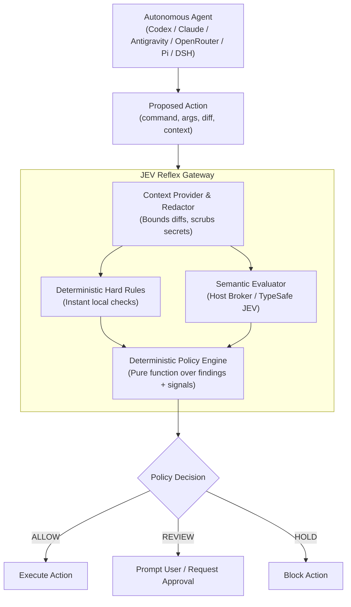

# JEV Reflex (`jrx`)

[](https://opensource.org/licenses/Apache-2.0)
[](https://www.python.org/downloads/)
[](https://github.com/astral-sh/ruff)
[](docs/architecture.md)

> **Probabilistic judgment. Deterministic enforcement.**

Deterministic execution control for autonomous coding agents (Codex CLI,
Claude Code, Antigravity, OpenRouter Agent SDK, Pi, DeepSeek Harness, and
custom terminal agents).

---

## Overview

Coding agents are probabilistic. Semantic models are probabilistic too. **JEV Reflex** does not pretend to make either one deterministic. Instead, it pairs instantaneous, local hard checks with bounded semantic risk signals (powered by [TypeSafe JEV](https://typesafe.ai/)), then applies an explicit, deterministic policy engine to determine whether an action should proceed.

### The Problem
* **Unconstrained Agents:** Autonomous coding agents can execute destructive commands (`rm -rf`, disk wipes), leak environment credentials, or perform out-of-boundary modifications before human review.
* **Pure Static Analysis is Incomplete:** Heuristic rules alone cannot discern subtle context (e.g., whether database migration scripts, external dependency updates, or complex privilege alterations are legitimate or malicious).
* **Model Decisions are Variable:** LLMs and probabilistic judges can fluctuate across runs. An AI model should never directly own an unmediated execution gate.

### The Solution: Hybrid Deterministic Enforcement


---

## In 30 Seconds

Test a dangerous command offline (no API key required):

```console
$ jrx check --demo --command "rm -rf ./cache"
```

Output:
```text
HARD RULES
  known_destructive  TRIGGERED (RECURSIVE_DELETE)

JEV SIGNALS
  destructive        0.98
  irreversible       0.76
  human_review       0.94

POLICY
  known_destructive:RECURSIVE_DELETE

FINAL
  HOLD
```

> [!NOTE]
> Demo mode (`--demo`) uses an offline, deterministic canned semantic evaluator. When you provide a `TYPESAFE_API_KEY`, live JEV semantic signals are queried.

---

## Installation & Setup

### Requirements
* Python **3.11** or newer
* Linux / macOS environment

### Install via pip / editable
```bash
# Clone the repository
git clone https://github.com/Madhumasa84/jrx.git
cd jrx

# Create and activate a virtual environment
python3.11 -m venv .venv
source .venv/bin/activate

# Install with development dependencies
pip install -e ".[dev]"
```

Both `jev-reflex` and its shorthand alias `jrx` are installed into your PATH.

### Environment Configuration (`.env`)

Authentication uses **BYOK (Bring Your Own Key)**. Supply your TypeSafe API key through the environment or a `.env` file:

```bash
cp .env.example .env
```

Edit `.env`:
```bash
# ==============================================================================
# JEV Reflex / JRX - Environment Configuration
# ==============================================================================
# TypeSafe API Key (BYOK) - Required for live JEV semantic evaluations
TYPESAFE_API_KEY="your-typesafe-api-key"

# Debug mode for JEV Reflex broker and CLI (1 = verbose, 0 = normal)
JRX_DEBUG=0
```

> [!IMPORTANT]
> Never commit `.env` or secret keys to version control. `.env` is ignored by default in `.gitignore`. The core policy and evaluator interfaces are vendor-neutral; TypeSafe is isolated behind a dedicated integration boundary.

---

## Key Concepts & Policy Decisions

The deterministic policy engine applies configured thresholds and hard rule triggers to produce one of three outcomes:

| Decision | Meaning | Typical Trigger |
| :--- | :--- | :--- |
| **`ALLOW`** | Safe to proceed. No hard rule triggered and semantic risks below review threshold. | Standard test runner (`pytest`), linting, read-only commands. |
| **`REVIEW`** | Meaningful uncertainty or risk. Requires explicit human confirmation. | Dependency updates, database migrations, security-sensitive flags. |
| **`HOLD`** | High risk or violation detected. Execution is blocked. | Recursive deletions, secret leaks, prompt injections, repository escape. |

### Execution Modes
Configure how `jrx exec` or agent adapters handle decisions:
* **`advisory`** (Default): Outputs recommendations without halting execution.
* **`review`**: Prompts the user or halts with non-zero exit status on `REVIEW` and `HOLD`.
* **`enforce`**: Blocks `HOLD` actions and rejects degraded semantic evaluations.

---

## CLI & Command Reference

The `jrx` (or `jev-reflex`) CLI provides targeted commands for action evaluation, execution wrapping, stability analysis, and daemon management:

### 1. Evaluate an Action (`check`)
Evaluate an action without executing it:
```bash
# Evaluate a shell command
jrx check --command "pytest tests/"

# Evaluate with bounded git diff from stdin
git diff | jrx check --stdin-diff --command "git commit -am 'Update auth logic'"

# Evaluate with task context
jrx check --task "Fix database migration" --command "python migrate.py"

# Evaluate using local deterministic checks only (no API calls)
jrx check --no-jev --command "git status"

# Stable JSON contract for agent hooks
jrx check --json --command "rm -rf ./temp"
```

### 2. Transparent Execution Wrapper (`exec`)
Wrap agent actions to intercept execution before damage occurs:
```bash
# In enforce mode: allows safe actions, halts on HOLD
jrx exec --mode enforce -- python migrate.py

# Preserves exact arguments and avoids shell injection risks
jrx exec --mode review -- npm install lodash
```

### 3. Compare Rule vs Semantic Impact (`compare`)
Compare what semantic evaluation adds over static rules:
```bash
jrx compare --demo --task "Update schema" --command "python migrate.py"
```

### 4. Measure Decision Stability (`stability`)
Run repeated evaluations across N runs to measure consistency, flip rate, and signal variance:
```bash
jrx stability --demo --runs 100 --command "python migrate.py"
```

### 5. Benchmark Suite (`benchmark`)
Run repeatable policy and stability benchmarks:
```bash
# Offline benchmark with fixture suites
jrx benchmark stability --runs 10

# Live TypeSafe benchmark with synthetic fixtures (requires API key)
jrx benchmark live --runs 5 --case dependency-upgrade --output benchmark-smoke.json
```

---

## Host-Side Broker (Secure Sandbox Isolation)

When coding agents run inside locked-down sandboxes (containers, VMs), outbound internet access may be restricted, or exposing `TYPESAFE_API_KEY` inside the sandbox may violate security policies.

JEV Reflex provides a **Host Broker** architecture:
```text
┌──────────────────────────────────────┐       ┌──────────────────────────────────────┐
│       Untrusted Agent Sandbox        │       │             Trusted Host             │
│                                      │       │                                      │
│  Codex CLI / Claude Code Hook        │       │  jrx broker (daemon)                 │
│         │                            │       │       │                              │
│         ▼                            │       │       ▼                              │
│  Local Hard Checks                   │       │  TypeSafe JEV API                    │
│         │                            │       │  (Key stored safely on host)         │
│         ▼                            │       │       │                              │
│  Unix Domain Socket Client ──────────┼───────┼───────┘                              │
│  (~/.jev-reflex/reflex.sock, 0600)   │  IPC  │                                      │
└──────────────────────────────────────┘       └──────────────────────────────────────┘
```

### Starting the Broker
In a trusted host shell with `TYPESAFE_API_KEY` set:
```bash
# Run broker interactively
jrx broker run

# Or run as a detached background daemon
jrx broker start

# Check status
jrx broker status --json

# Stop broker
jrx broker stop
```

### Using the Broker from Sandbox
From an agent shell where `TYPESAFE_API_KEY` is not present:
```bash
env -u TYPESAFE_API_KEY jrx check --transport broker --command "python migrate.py"
```

See [docs/broker.md](docs/broker.md) for full socket protocols, timeouts, and daemon lifecycle details.

---

## Agent Integrations

### Codex CLI
Codex CLI supports native `PreToolUse` lifecycle hooks. Configure `.codex/hooks.json`:

```json
{
  "description": "JEV Reflex deterministic execution control",
  "hooks": {
    "PreToolUse": [
      {
        "matcher": "Bash|bash|command_execution|apply_patch|mcp__.*",
        "hooks": [
          {
            "type": "command",
            "command": "jev-reflex codex-hook",
            "timeout": 30,
            "statusMessage": "JEV Reflex is checking the proposed action"
          }
        ]
      }
    ]
  }
}
```
See [docs/codex.md](docs/codex.md) for detailed configuration and trust reviews.

### Claude Code
Claude Code supports `PreToolUse` hooks natively. Configure via:
```bash
jev-reflex claude-code-hook --mode enforce
```
`HOLD` decisions map to `deny`, and `REVIEW` maps to `ask`. See [docs/claude-code.md](docs/claude-code.md).

### Generic Terminal Agents
Any terminal-based agent can incorporate execution control via:
```bash
jrx exec --mode enforce -- <command>
```
Or query policy as JSON via `jrx check --json --command "..."`. See [examples/AGENTS.md](examples/AGENTS.md).

### Antigravity, OpenRouter, Pi, and DeepSeek Harness

Native integrations are available for the other common harness surfaces:

| Harness | Integration | Native entry point |
| :--- | :--- | :--- |
| Antigravity | `.agents/hooks.json` command hook | `jev-reflex antigravity-hook` |
| OpenRouter Agent SDK | Python lifecycle hooks | `evaluate_openrouter_hook(...)` |
| Pi | TypeScript `tool_call` extension | `jev-reflex pi-hook` |
| DeepSeek Harness | Codex hook bridge | `jev-reflex deepseek-hook` |

See [docs/harnesses.md](docs/harnesses.md) and the ready-to-copy files in
[`examples/antigravity`](examples/antigravity), [`examples/openrouter`](examples/openrouter),
[`examples/pi`](examples/pi), and [`examples/deepseek`](examples/deepseek). Each adapter preserves the same
`advisory`, `review`, and `enforce` semantics; the host harness remains the
owner of model authentication and its normal sandbox controls.

---

## Configuration (`reflex.yaml`)

Copy [reflex.example.yaml](reflex.example.yaml) to `reflex.yaml` to configure project-level thresholds and rules:

```yaml
mode: advisory # advisory | review | enforce

thresholds:
  review: 0.70
  hold: 0.90

hold_on:
  - destructive
  - secret_exposure
  - irreversible
  - prompt_injection
  - wrong_repo
  - fail_open

review_on:
  - security_sensitive
  - concurrency_sensitive
  - persistence_sensitive
  - backwards_compatibility
  - human_review

jev:
  samples: 1
  aggregation: median # median | mean | max
  transport: direct   # direct | broker
  socket: ~/.jev-reflex/reflex.sock

stability:
  boundary_margin: 0.03

stability_policy:
  mode: strict # strict | conservative | majority

privacy:
  redact_secrets: true
  store_requests: false
```

---

## Architecture & Design Principles

```text
ContextProvider (bounds diff, scrubs secrets)
      ↓
Deterministic Checks ─────────────┐
      │                           │
      └──── Semantic Evaluator ───┤
                                  ↓
                        Policy Engine (pure function)
                                  ↓
                        ALLOW / REVIEW / HOLD
                                  ↓
                        CLI / Wrapper / Hook
```

* **Separation of Concerns:** Policy evaluation makes zero network calls. The semantic evaluator never makes final execution decisions.
* **Deterministic Boundary:** Identical findings + identical semantic probabilities + identical config = identical decision every time.
* **Bounded Context:** Diff sizes and prompt strings are deterministically bounded before IPC/network transmission.
* **Zero Host Pollution:** Redaction strips credential patterns (bearer tokens, private keys, AWS/GitHub tokens) prior to any logging or transmission.

See [docs/architecture.md](docs/architecture.md) and [docs/security.md](docs/security.md).

---

## Testing & Quality Assurance

```bash
# Run unit and integration tests
make test
# Or directly with pytest in the virtual environment
.venv/bin/pytest

# Lint and check formatting
make lint

# Run offline benchmark suite
jrx benchmark stability --runs 10

# Run automated demo walkthrough
bash examples/demo.sh
```

---

## Known Limitations

* **Observation vs Determinism Proof:** Model generation remains probabilistic. Stability metrics represent observed empirical consistency over evaluated runs.
* **Heuristic Redaction:** Secret redaction uses a hybrid approach: regex patterns for common credential patterns plus optional gitleaks integration for comprehensive secret detection. When gitleaks is available, it provides extensive rule coverage; when unavailable, it falls back to regex-only redaction. This is not a substitute for a full secrets vault or secure secret management practices.
* **Time-of-Check to Time-of-Use (TOCTOU):** User-space pre-execution checks cannot eliminate all concurrent filesystem race conditions.
* **Hook Coverage:** Commands executed outside the configured agent hook or wrapper bypass local inspection.

---

## Contributing

Contributions, bug reports, and suggestions are welcome!
1. Ensure all vendor-specific integrations remain decoupled behind the adapter boundary.
2. Add tests for all new checks or policy rules in `tests/`.
3. Verify that `make test` and `make lint` pass before submitting pull requests.

---

## License

This project is licensed under the **Apache 2.0 License**. See [LICENSE](LICENSE) for details.
