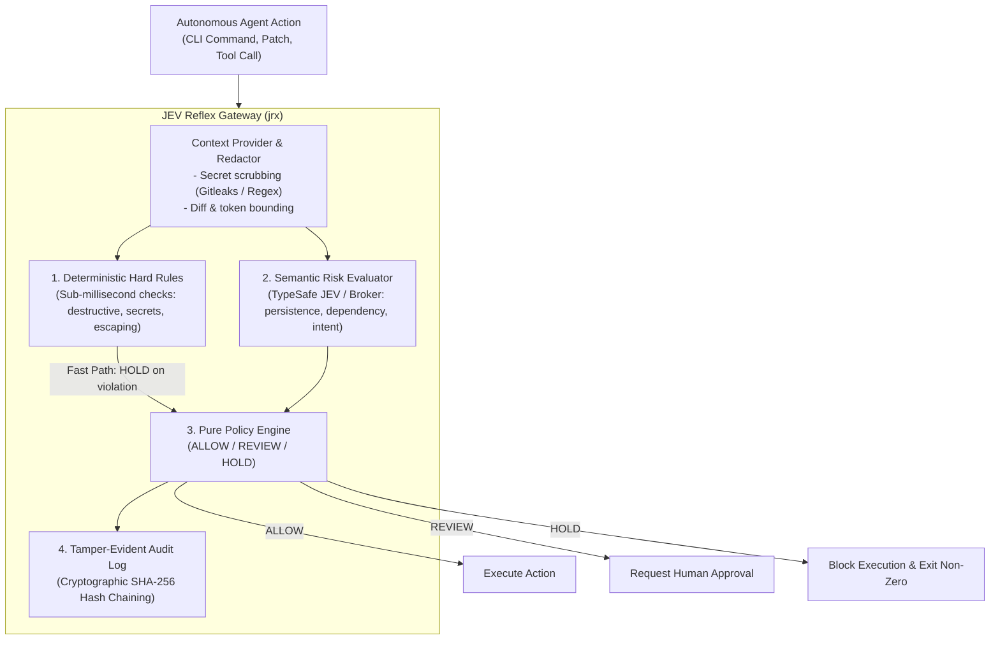

<div align="center">

# JEV Reflex (`jrx`)

**Deterministic Execution Control for Autonomous Coding Agents**

[](LICENSE)
[](https://www.python.org/downloads/)
[](https://github.com/astral-sh/ruff)
[](docs/architecture.md)
[](docs/security.md)

<p align="center">
  <a href="#quickstart">Quickstart</a> •
  <a href="#the-jev-reflex-paradigm">Architecture</a> •
  <a href="#supported-agent-harnesses">Supported Agents</a> •
  <a href="#host-broker-architecture">Host Broker</a> •
  <a href="#verified-identity-and-reviewed-execution">Identity &amp; Approvals</a> •
  <a href="#cli-command-reference">CLI Reference</a> •
  <a href="#configuration-reference-reflexyaml">Configuration</a> •
  <a href="#documentation-index">Documentation</a>
</p>

> *“Probabilistic judgment. Deterministic enforcement.”*

</div>

---

## The Problem & The Solution

Coding agents (OpenAI Codex, Claude Code, Antigravity, OpenRouter, Pi, DeepSeek) are **probabilistic**. Semantic evaluation models are probabilistic too. 

Relying solely on LLM self-policing or naive regex blacklists inevitably fails:
* **Unconstrained Agents:** Can execute catastrophic operations (`rm -rf /`, raw disk writes, force branch deletion), leak environment credentials, or escape workspace boundaries.
* **Regex Blacklists Are Fragile:** Static pattern matching cannot grasp intent—such as discerning whether a database migration or dependency update is legitimate or malicious.
* **Model Decisions Fluctuate:** An AI model should never directly own an unmediated execution gate without deterministic guardrails.

### The JEV Reflex Paradigm
**JEV Reflex (`jrx`)** unites **instantaneous local hard rules** with **bounded semantic risk signals** (powered by [TypeSafe JEV](https://typesafe.ai/)). A pure, deterministic policy engine then maps these inputs to a definitive decision: **`ALLOW`**, **`REVIEW`**, or **`HOLD`**.

For enterprise deployments, optional access controls add:

* **Verified identity and scoped roles:** Validate a company OIDC token and allow execution or review by role, repository, and environment.
* **Reviewed approvals:** Queue risky commands for independent reviewers. Bind each approval to the requester, exact command, repository state, policy, and environment; expire it after one use. Production requires two reviewers.
* **Policy rollout:** Replay verified audit decisions against a proposed policy, stage a signed revision, promote a stable percentage of repositories, and roll back the active revision.
* **Operations dashboard:** View authorized teams' blocked actions, pending approvals, broker health, policy versions, overrides, and metrics from a read-only local dashboard.
* **MCP tool gateway:** Enforce explicit rules for structured database, cloud, and ticket tool calls before they reach an MCP server.
* **Session limits:** Cap calls, semantic evaluations and reserved spend, elapsed time, command duration, and repeated risky actions; administrators can stop a session.

[Configure identity and approvals](#verified-identity-and-reviewed-execution).

[Configure policy rollout and the operations dashboard](#policy-rollout-and-operations-dashboard).

[Configure the MCP gateway and session limits](#mcp-gateway-and-session-limits).



---

## Quickstart

### 1. Installation

```bash
# Clone the repository
git clone https://github.com/Madhumasa84/jrx.git
cd jrx

# Create and activate virtual environment
python3 -m venv .venv
source .venv/bin/activate

# Install with development dependencies
pip install -e ".[dev]"
```

Both `jrx` and `jev-reflex` CLI commands will be available in your `$PATH`.

### 2. Configure Credentials (BYOK)

JEV Reflex follows a **Bring-Your-Own-Key (BYOK)** model. Provide your TypeSafe API key via environment variable or `.env`:

```bash
cp .env.example .env
# Edit .env with your credentials:
# TYPESAFE_API_KEY="your-typesafe-api-key"
```

### 3. Test in 10 Seconds (Offline Demo Mode)

Evaluate a dangerous command offline without needing an API key:

```bash
$ jrx check --demo --command "rm -rf ./cache"
```

```text
HARD RULES
  known_destructive  TRIGGERED (RECURSIVE_DELETE)

JEV SIGNALS
  destructive        0.98
  irreversible       0.76
  human_review       0.94

POLICY
  known_destructive:RECURSIVE_DELETE

FINAL
  HOLD
```

---

## Policy Decisions & Modes

JEV Reflex calculates deterministic results across 18 semantic risk dimensions:

| Decision | Meaning | Execution Behavior | Example Trigger |
| :--- | :--- | :--- | :--- |
| **`ALLOW`** | Safe to proceed | Executes transparently | `pytest tests/`, `ruff check`, read-only commands |
| **`REVIEW`** | Moderate risk / Ambiguous intent | Pauses for human confirmation | `alembic upgrade`, `pip install`, config mutations |
| **`HOLD`** | Critical hazard detected | **Terminates execution** | `rm -rf /`, `git push --force`, credential export |

### Execution Modes
* **`advisory`** (Default): Emits structured audit warnings and signals without interrupting execution. Ideal for CI observation and baseline calibration.
* **`review`**: Prompts the developer or halts execution whenever a `REVIEW` or `HOLD` condition is triggered.
* **`enforce`**: Strictly blocks `HOLD` actions and treats degraded/unavailable semantic evaluations as fail-closed.

### Verified identity and reviewed execution

Set `access` in a protected, signed policy to enable OIDC identity checks. The host supplies an RS256 signed ID token in `JRX_ID_TOKEN`; JEV Reflex verifies its signature against the configured HTTPS JWKS endpoint, issuer, audience, expiry, subject, and roles claim. The role rules scope `execute` and `review` to exact repository paths and environments. Keep the token in a trusted host process; an agent that can read the token can act as that identity. The configured environment is authoritative, so a caller cannot label a production action as development.

```yaml
mode: review
access:
  issuer: https://sso.example.com
  audience: jrx
  jwks_uri: https://sso.example.com/keys
  environment: production
  approval_db: /var/lib/jrx/approvals.sqlite3
  approval_ttl_seconds: 900
  production_environments: [production]
  roles_claim: roles
  rules:
    - role: developer
      actions: [execute]
      repositories: [/srv/my-project]
      environments: [production]
    - role: reviewer
      actions: [review]
      repositories: [/srv/my-project]
      environments: [production]
```

For a risky action, the developer requests approval and gives its ID to reviewers. Reviewers inspect `jrx approval pending` and each grants independently. Production requires two distinct reviewers; the requester cannot approve their own action. The approval expires, can be used once, and is bound to the exact command, working directory, Git state, effective policy, environment, and requester. Commands that exceed 1,000 characters or contain text requiring secret redaction cannot be submitted for approval. In enforce mode, an unavailable semantic evaluation blocks execution even with approval.

```bash
jrx approval request --config reflex.yaml --cwd /srv/my-project \
  --environment production --command 'python migrate.py'
jrx approval pending --config reflex.yaml
jrx approval grant APPROVAL_ID --config reflex.yaml
jrx exec --config reflex.yaml --cwd /srv/my-project \
  --environment production --approval-id APPROVAL_ID -- python migrate.py
```

Agent hooks use `JRX_ENVIRONMENT` and `JRX_APPROVAL_ID` from the trusted host. For a shell hook, request approval with `--hook-command` to bind the raw shell command. Enterprise execution refuses demo mode, disabled semantic evaluation, and CLI mode overrides. Hooks fail closed if identity or approval checks fail. Approval requests currently cover shell commands; other tool actions with a REVIEW or HOLD result remain blocked in enterprise mode.

---

## Supported Agent Harnesses

JEV Reflex features native hook adapters for leading coding agent frameworks:

| Agent / Harness | Integration Hook | Adapter Command | Docs |
| :--- | :--- | :--- | :--- |
| **OpenAI Codex CLI** | `.codex/hooks.json` PreToolUse | `jrx codex-hook` | [Guide](docs/harnesses.md#1-openai-codex-cli) |
| **Anthropic Claude Code** | `.claude/settings.json` PreToolUse | `jrx claude-code-hook` | [Guide](docs/harnesses.md#2-anthropic-claude-code) |
| **Google Antigravity** | `.agents/hooks.json` PreToolUse | `jrx antigravity-hook` | [Guide](docs/harnesses.md#3-google-antigravity) |
| **OpenRouter Agent SDK** | Python & TypeScript Lifecycle Hooks | `jrx openrouter-hook` | [Guide](docs/harnesses.md#4-openrouter-agent-sdk) |
| **Pi Coding Agent** | `.pi/extensions/` Extension Event | `jrx pi-hook` | [Guide](docs/harnesses.md#5-pi-agent) |
| **DeepSeek Harness** | `dsh-hooks-codex` Bridge Protocol | `jrx deepseek-hook` | [Guide](docs/harnesses.md#6-deepseek-harness) |
| **Universal Wrapper** | Standard CLI Prefix | `jrx exec --mode enforce -- <cmd>` | [Guide](docs/harnesses.md#7-universal-cli-wrapper-fallback) |

*Full integration instructions and ready-to-copy hook configurations are documented in [docs/harnesses.md](docs/harnesses.md).*

---

## Host Broker Architecture

In enterprise sandbox environments (Docker containers, microVMs, Kubernetes pods), passing raw API keys into the untrusted agent environment violates least privilege.

The **JEV Reflex Host Broker** isolates credentials in the host environment while serving evaluations over a restricted Unix domain socket:

```
┌─────────────────────────────────────────┐         ┌─────────────────────────────────────────┐
│     Untrusted Agent Sandbox / Pod       │         │        Trusted Host Environment         │
│                                         │         │                                         │
│   Agent (Codex / Claude / Custom)       │         │   jrx broker (Background Daemon)        │
│         │                               │         │         │                               │
│         ▼                               │         │         ▼                               │
│   Local Hard Checks                     │  POSIX  │   TypeSafe JEV API Gateway              │
│         │                               │ Socket  │   (TYPESAFE_API_KEY stored on host)     │
│         ▼                               │ (0600)  │         │                               │
│   Unix Socket Client ───────────────────┼─────────┼─────────┘                               │
│   ~/.jev-reflex/reflex.sock             │         │   Prometheus Metrics Server (:9090)     │
└─────────────────────────────────────────┘         └─────────────────────────────────────────┘
```

### Managing the Broker Daemon

```bash
# Start broker in foreground (useful for development & debugging)
jrx broker run

# Start broker as a detached background daemon
jrx broker start

# Query broker health and socket status
jrx broker status --json

# Terminate broker daemon
jrx broker stop
```

---

## Cryptographic Audit Trail & Governance

Every decision evaluated by JEV Reflex is permanently logged to an append-only, SHA-256 hash-chained Merkle ledger.

### Verifying Log Integrity
Detect any unauthorized alteration, sequence reordering, or record deletion:

```bash
$ jrx audit verify
Audit log cryptographic integrity verified: 1042 entries checked (0 errors).
```

### Human Override Tracking
Track authorized manual bypasses for auditing and governance compliance:

```bash
# Authorize an override as a named approver
jrx exec --mode enforce --allow-override --approver "lead-secops" -- terraform apply

# Review audit trail of overrides
jrx audit overrides --since 2026-09-01
```

### Cryptographic Policy Signing
Guarantee that policies cannot be modified by unprivileged local developers:

```bash
# Generate Ed25519 signing keypair
jrx policy keygen --output-dir ~/.jrx/keys

# Sign a policy file
jrx policy sign reflex.yaml --key ~/.jrx/keys/policy_signing.key

# Verify policy authenticity
jrx policy verify reflex.yaml --public-key ~/.jrx/keys/policy_signing.pub
```

## Policy rollout and operations dashboard

Policy simulation replays the deterministic findings, semantic signals, risk classification, and degraded state stored in new audit entries. It verifies the audit hash chain first, checks that each entry was evaluated under the baseline policy, and reports every `ALLOW`/`REVIEW`/`HOLD` transition. Older entries lacking replay inputs are counted as skipped. Simulation does not rerun the semantic model or reconstruct a command from its audit summary. Enable `audit.enabled: true` in the policy before collecting rollout evidence.

```bash
jrx policy simulate --audit /var/log/jrx/audit.jsonl \
  --baseline reflex.yaml --candidate proposed.yaml
```

Configure a signed policy source and rollout state in the host bootstrap file (`/etc/jrx/bootstrap.yaml` or `~/.jev-reflex/bootstrap.yaml`). The pinned public key is the **PEM content**, not a path. Keep the state file in a host-controlled directory; JRX writes it with owner-only permissions.

```yaml
require_signature: true
public_key_path: /etc/jrx/policy-signing.pub
rollout_state_path: /var/lib/jrx/policy-rollout.json
policy_source:
  type: https
  uri: https://policies.example.org/reflex.yaml
  pinned_signature_pubkey: |
    -----BEGIN PUBLIC KEY-----
    ...
    -----END PUBLIC KEY-----
```

The fetched candidate must have a valid Ed25519 signature. Staging requires at least one matching replayed decision. By default, it rejects any new `ALLOW` decision; set `--max-new-allows` only after reviewing the simulation. The baseline file must match the active rollout revision. Canary selection hashes the repository scope so the same repository remains in the same cohort at a given percentage.

```bash
jrx policy rollout stage --bootstrap /etc/jrx/bootstrap.yaml \
  --baseline reflex.yaml --audit /var/log/jrx/audit.jsonl
jrx policy rollout promote --bootstrap /etc/jrx/bootstrap.yaml --percent 10
jrx policy rollout status --bootstrap /etc/jrx/bootstrap.yaml
jrx policy rollout promote --bootstrap /etc/jrx/bootstrap.yaml --percent 100
jrx policy rollout rollback --bootstrap /etc/jrx/bootstrap.yaml
```

`rollback` discards an in-progress candidate, or restores the previous fully promoted revision. The host's bootstrap file must be at one of the standard locations for `check`, `exec`, and hooks to select the staged policy. Production rollout operators should keep a copy of the currently active policy to use as the next staging baseline.

The dashboard reads local audit logs, approval databases, rollout state, broker sockets, and Prometheus metrics endpoints for configured teams. It verifies audit integrity before showing decisions. Set an OIDC `view` rule for each repository and run the server on loopback. The browser requests an OIDC token and keeps it only in page memory. Use an authenticated HTTPS proxy for remote access.

```yaml
# dashboard.yaml
access:
  issuer: https://idp.example.org
  audience: jrx
  jwks_uri: https://idp.example.org/.well-known/jwks.json
  environment: dashboard
  rules:
    - role: operations
      actions: [view]
      repositories: [/srv/team-a/repo]
      environments: [dashboard]
sources:
  - team: team-a
    repository: /srv/team-a/repo
    policy_path: /srv/team-a/repo/reflex.yaml
    audit_path: /var/log/jrx/team-a.jsonl
    # Add audit_public_key_path when audit entries are signed.
    # audit_public_key_path: /etc/jrx/audit-signing.pub
    approval_db: /var/lib/jrx/team-a-approvals.sqlite3
    rollout_state_path: /var/lib/jrx/team-a-rollout.json
    broker_socket: /run/jrx/team-a.sock
    metrics_port: 9090
```

```bash
jrx dashboard serve --config dashboard.yaml --port 8080
```

This dashboard aggregates sources on the host where it runs. To view multiple hosts, mount their read-only data or run a dashboard per host. Metrics are read from loopback, and the dashboard does not label metrics with repository or user identifiers.

The workflow follows the signed activation and status patterns described by [Open Policy Agent bundle management](https://www.openpolicyagent.org/docs/management-bundles) and its [status API](https://www.openpolicyagent.org/docs/management-status). Broker metrics follow [Prometheus exposition](https://prometheus.io/docs/instrumenting/exposition_formats/) and keep labels bounded as recommended in [Prometheus instrumentation guidance](https://prometheus.io/docs/practices/instrumentation/). JRX uses its own policy file format; it does not consume OPA bundles.

## MCP gateway and session limits

The MCP gateway wraps a trusted **stdio** MCP server. It passes protocol messages through and checks each `tools/call` request before forwarding it. Server and tool names must be listed exactly in `mcp.tools`; unknown pairs fail closed. `destructive` tools are blocked. `write` tools require a live semantic `ALLOW` result, while `read` tools may use deterministic checks only. The gateway returns denied calls as MCP tool results with `isError: true`, leaving the upstream server untouched. Configure the gateway as the MCP server command in your agent host.

```yaml
# reflex.yaml
mode: enforce
mcp:
  use_jev: true
  timeout_seconds: 30
  tools:
    - {server: data, name: db.read, effect: read}
    - {server: data, name: db.update, effect: write}
    - {server: cloud, name: cloud.delete, effect: destructive}
    - {server: tickets, name: ticket.change, effect: write}
session:
  enabled: true
  path: /var/lib/jrx/sessions.sqlite3
  max_tool_calls: 100
  max_semantic_evaluations: 50
  max_semantic_spend_usd: 5.00
  reserved_cost_per_evaluation_usd: 0.05
  max_elapsed_seconds: 3600
  max_execution_seconds: 300
  max_risky_attempts: 3
```

```bash
# Set JRX_SESSION_ID in the trusted host process for check, exec, and hooks.
export JRX_SESSION_ID=agent-run-123
jrx mcp serve --config reflex.yaml --server data --session-id agent-run-123 \
  -- python -m my_mcp_server
jrx session status agent-run-123 --config reflex.yaml
jrx session stop agent-run-123 --config reflex.yaml
```

The session ID must come from the trusted host and remain fixed for the agent run. The SQLite ledger atomically reserves calls and an operator-configured **upper-bound estimate** before each semantic evaluation. `reserved_spend_usd` is a budget estimate, not provider billing; set `reserved_cost_per_evaluation_usd` above the largest expected evaluation cost. The administrator stop blocks subsequent evaluations and tool calls and terminates a session-managed `jrx exec` process at its next check. A command is also terminated when `max_execution_seconds` elapses. Each repeated `REVIEW`, `HOLD`, or degraded action counts toward `max_risky_attempts`. When `access` is configured, `session stop` and `status` require an OIDC rule with `actions: [admin]`, `repositories: ['*']`, and the configured environment.

The gateway checks repository-scoped `execute` permission when `access` is configured. It currently supports stdio MCP servers; Streamable HTTP transport is outside this gateway. Tool rules classify the known upstream tools and should be maintained when that server changes its catalog. The wire behavior follows the MCP [stdio transport](https://modelcontextprotocol.io/specification/2025-06-18/basic/transports) and [tool error](https://modelcontextprotocol.io/specification/2025-06-18/server/tools) conventions.

---

## CLI Command Reference

| Command | Usage | Description |
| :--- | :--- | :--- |
| `jrx check` | `jrx check --command "<cmd>"` | Analyze proposed action without executing. Supports `--json`, `--task`, `--stdin-diff`. |
| `jrx exec` | `jrx exec --mode enforce -- <cmd>` | Evaluate and execute command safely. Blocks execution on `HOLD`. |
| `jrx approval` | `jrx approval [request\|pending\|grant]` | Request an action-bound approval, show a reviewer's queue, or grant approval. |
| `jrx compare` | `jrx compare --command "<cmd>"` | Compare deterministic-only rules versus combined JEV semantic evaluation. |
| `jrx stability` | `jrx stability --runs 100 --command "<cmd>"` | Test decision consistency and calculate flip rates over repeated evaluations. |
| `jrx broker` | `jrx broker [run\|start\|stop\|status]` | Manage the host-side semantic daemon and IPC socket. |
| `jrx audit` | `jrx audit [verify\|overrides\|export]` | Audit log verification, override governance, and SIEM exports. |
| `jrx policy` | `jrx policy [sign\|verify\|test\|keygen\|simulate\|rollout]` | Policy signing, regression testing, replay, and staged rollout. |
| `jrx dashboard` | `jrx dashboard serve --config dashboard.yaml` | OIDC-protected local operations dashboard. |
| `jrx mcp` | `jrx mcp serve --config reflex.yaml --server NAME -- <server command>` | Policy-enforcing stdio MCP gateway. |
| `jrx session` | `jrx session [status\|stop] SESSION_ID --config reflex.yaml` | Inspect a session budget or stop the session. |
| `jrx benchmark` | `jrx benchmark [stability\|live]` | Run automated offline test suites or live TypeSafe API benchmarks. |

---

## Configuration Reference (`reflex.yaml`)

Configure thresholds, hard rules, and evaluation behaviors with `reflex.yaml`:

Enterprise identity and approval settings are shown in [Verified identity and reviewed execution](#verified-identity-and-reviewed-execution).

```yaml
# Execution mode: advisory | review | enforce
mode: advisory

# Decision thresholds (0.0 to 1.0)
thresholds:
  review: 0.70
  hold: 0.90

# Semantic categories that trigger immediate HOLD
hold_on:
  - destructive
  - secret_exposure
  - irreversible
  - prompt_injection
  - wrong_repo
  - fail_open

# Semantic categories that require explicit REVIEW
review_on:
  - security_sensitive
  - concurrency_sensitive
  - persistence_sensitive
  - backwards_compatibility
  - human_review

# JEV Semantic Settings
jev:
  transport: direct      # direct | broker | broker-tls
  socket: ~/.jev-reflex/reflex.sock
  samples: 1             # Number of semantic samples to aggregate
  aggregation: median    # median | mean | max
  api_timeout: 20.0

# Cryptographic Governance
signing:
  require_signature: false
  public_key_path: ~/.jrx/keys/policy_signing.pub

# Human Override Rules
override:
  allow_hold_override: false  # When false, HOLD actions can NEVER be bypassed
```

---

## Production & Container Deployment

### Docker Container
Build and deploy the lightweight, non-root container image:

```bash
docker build -t jrx-broker:latest .

docker run -d \
  --name jrx-broker \
  -e TYPESAFE_API_KEY="your-api-key" \
  -p 9090:9090 \
  jrx-broker:latest
```

### Kubernetes Helm Chart
Deploy the broker into Kubernetes clusters using the included Helm chart:

```bash
# Validate chart
helm lint ./helm/jrx-broker

# Install chart
helm install jrx-broker ./helm/jrx-broker \
  --set env.TYPESAFE_API_KEY="your-api-key" \
  --set service.metrics.port=9090
```

---

## Documentation Index

| Guide | Content |
| :--- | :--- |
| **[System Architecture](docs/architecture.md)** | Deep dive into the 4-stage pipeline, context bounding, and pure policy logic. |
| **[Harness Integrations](docs/harnesses.md)** | Comprehensive setup guides for Codex, Claude Code, Antigravity, OpenRouter, Pi, and DeepSeek. |
| **[Security Architecture](docs/security.md)** | Hard check mechanics, secret redaction engine, Ed25519 signing, and boundary traversal defenses. |
| **[Enterprise Threat Model](docs/threat-model.md)** | Formal security boundaries, 12 attacker personas, and negative security findings. |
| **[Host Broker Daemon](docs/broker.md)** | Unix socket protocol, permissions specification, mTLS transport, and IPC limits. |
| **[Observability & Metrics](docs/observability.md)** | Prometheus metrics exposition (`:9090/metrics`), structured logging, and calibration. |
| **[Benchmark Methodology](docs/live-benchmark.md)** | Empirical stability metrics, decision consistency calculation, and live API test suites. |

---

## Contributing

Contributions, bug reports, and discussions are welcome!

1. Ensure vendor-specific logic remains decoupled in `src/jev_reflex/adapters/`.
2. Maintain zero host pollution—all tests should run in isolated temporary sandboxes.
3. Verify linting and test suites pass:
   ```bash
   make lint
   make test
   ```

---

## License

JEV Reflex is open-source software licensed under the **Apache License 2.0**. See the [LICENSE](LICENSE) file for details.
