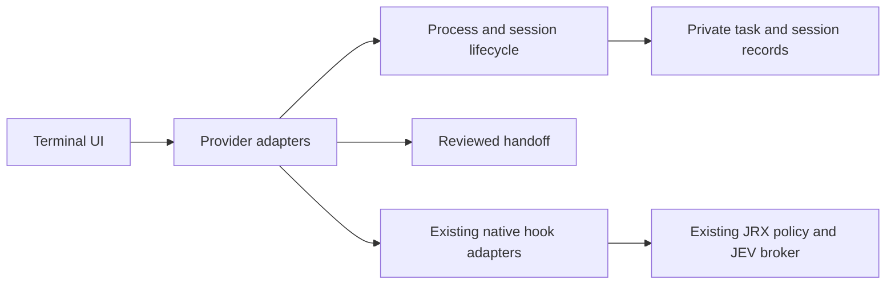

# Unified agent workspace

`jrx` opens a local terminal workspace for Codex CLI, Claude Code CLI, and
Antigravity CLI. Each selected provider process uses its official executable,
native login, native permission settings, and native session store. JRX does not
require an OpenAI, Anthropic, or Gemini inference API key.

The workspace and adapters are implemented. Real-provider smokes ran on
2026-09-27; the final local test and package checks ran on 2026-09-28. Codex
and Antigravity passed the tested native hook denial and cross-provider context
checks described below. Protected launches remain blocked in the current JRX
source workspace: its provider hooks are not configured or trusted there, and
the test hook files and temporary policy are scoped to disposable workspaces.
The gate was not removed to run the tests.
Existing `jrx check`, `jrx exec`, hook commands, broker commands, and the
TypeSafe integration remain available.

## Install and use

From a checkout:

```console
python3 -m venv .venv
. .venv/bin/activate
pip install -e ".[dev]"
jrx
```

For a normal package installation, use `pip install .`. JRX does not install
or update provider CLIs. Install and authenticate each CLI using its official
instructions, then check what JRX can detect:

```console
jrx doctor
jrx doctor --models
jrx doctor --provider codex --json
jrx --help
```

`doctor` reports executable status, detected version, a reduced authentication
label, visible provider API-key environment conflicts, hook-file status, model
discovery, JEV status, and the current policy mode. Authentication is shown as
unknown when no documented safe status command is available. The command never
prints API-key values or account email addresses.

Hook setup is preview-only by default:

```console
jrx setup --provider codex --workspace .
jrx setup --provider codex --workspace . --apply
jrx setup --provider codex --workspace . --rollback
```

`--apply` and `--rollback` show the proposed diff and require an interactive
confirmation. Setup merges a JRX hook entry into the provider file, keeps other
settings, and creates an owner-only backup when an existing file changes.
Rollback removes only the JRX hook entry. Open the provider's own trust or hook
screen after setup; JRX cannot verify that the provider loaded or trusted it.

The interactive workspace keys are:

| Key | Action |
| --- | --- |
| Up/down or `1`–`3` | Select a provider |
| `m` | Discover available models, or use the provider's native selector |
| `t` | Enter an objective and optional user-reported context |
| Enter | Start the selected native CLI; Antigravity may use its documented structured mode for an initial prompt |
| `r` | Choose a saved provider session, then resume it natively |
| `s` | Preview and apply the selected hook configuration |
| `h` | Review a portable cross-provider checkpoint |
| `i` | Start one explicitly labelled advisory structured run |
| `q` | Leave JRX |

JRX suspends its screen and gives the selected native CLI the foreground
terminal. It restores the JRX screen when the provider exits. If a saved native
session ID is unavailable, JRX asks before using the provider's own recent
session behavior. It never transfers a provider session reference to another
provider.

The terminal workspace currently supports Linux and macOS terminals. The TUI
requires Python `curses` and POSIX process groups. Windows remains unsupported
for the TUI and managed writer lock; `doctor` and preview operations may still
be useful there. This implementation was exercised on Linux only.

## Capability matrix

The table separates documented CLI behavior from checks run in this checkout.
Model lists are queried from the provider or delegated to its native selector;
JRX does not ship a complete model catalogue.

| Provider | Installed CLI and authentication | Model discovery and selection | Session tracking and resume | Streaming and approvals | Real JRX hook checks |
| --- | --- | --- | --- | --- | --- |
| Codex CLI | `codex` 0.157.1 on Linux. `codex login status` reported `Logged in using ChatGPT`. No provider API-key environment conflict was detected. | The installed CLI documents `--model` and `/model`. JRX's model discovery reports the app-server list as experimental and directs users to the native selector. A model change and effective model identity were not verified in this run; JRX keeps model identity unknown. | JRX captured a native session reference from `codex exec --json`, resumed that same thread with `codex exec resume`, and verified the workspace and task context. The installed resume help has no `--sandbox`; JRX now requires a known initial sandbox mode and relies on the session's saved native restrictions. | Structured JSONL output and tool activity streamed before turn completion. No real provider approval boundary was provoked; JRX does not send integrated approval replies. Native permission interaction remains with Codex. | In a disposable hooked workspace: marker-writing shell call denied; `apply_patch` edit of a protected fixture denied; `pwd` allowed; broker outage produced degraded `REVIEW` and denial. Only the tested shell and `apply_patch` paths are evidenced. MCP is unverified. |
| Claude Code | **Unverified and outside this verification scope.** | Unverified. | Unverified. | Unverified. | Unverified. |
| Antigravity CLI | `agy` 1.2.12 on Linux. No documented safe status command exists. The native CLI showed the existing signed-in Google AI Pro account during the smoke; no account identifier or token was retained. No provider API-key environment conflict was detected. | `agy models` was used by JRX to select `gemini-3.8-flash-low`; Antigravity's structured `init` event confirmed that model. A later cancellation probe hit the labelled native-selector fallback when model discovery timed out. | JRX captured an Antigravity conversation ID from `init` and resumed it with documented `--conversation`; both the same session and shared task context were confirmed. | `--output-format stream-json` produced incremental output and tool activity before successful completion. Integrated approval replies are unsupported. A harmless `pwd` run completed without `WAITING`, so the native fallback from a real approval boundary was not exercised. | In a disposable hooked workspace: native file replacement denied; a shell marker-writing action was denied (the attempted command also contained deletion of a separate disposable fixture); `pwd` allowed; broker outage produced degraded `REVIEW` and denial. Only the tested shell and file-edit paths are evidenced. MCP is unverified. |

Documentation sources:

- [Codex CLI reference](https://developers.openai.com/codex/cli/reference) and [Codex hooks](https://developers.openai.com/codex/hooks)
- [Claude Code CLI usage](https://code.claude.com/docs/en/cli-usage) and [Claude Code hooks](https://code.claude.com/docs/en/hooks)
- [Antigravity CLI reference](https://antigravity.google/docs/cli/reference), [headless mode](https://antigravity.google/docs/cli/headless/), [hooks](https://antigravity.google/docs/hooks), and [installation and authentication](https://antigravity.google/docs/cli-install)

Provider versions, authentication labels, and model/session behavior above were
observed on Linux on 2026-09-27. The Antigravity native model list included
multiple account-visible choices. Codex model discovery was not available from
JRX, and no effective Codex model identifier was observed.

### Real-provider verification matrix

These smokes ran on Linux on 2026-09-27 in temporary workspaces. The native
provider CLIs were launched with their existing subscription sessions. No
provider token or account identifier was read or retained. The evidence files
are bounded JSON summaries and hook audit logs under
`/tmp/jrx-unified-workspace-verification`; files are owner-only, and raw
transcripts are not included in this repository.

| Provider / version | Action | Expected result | Observed result | Evidence |
| --- | --- | --- | --- | --- |
| Codex 0.157.1 | Create `.jrx-shell-marker-blocked` from a provider shell tool | Actual `Bash` hook returns JRX denial; marker stays absent | Codex attempted the command; hook correlation recorded the same provider session and action hashes; JEV `REVIEW` was translated to a native deny; Codex did not create the marker | `codex-enforcement-audit.jsonl`, sequence 3 |
| Codex 0.157.1 | Replace the protected fixture with a synthetic token-shaped string through native `apply_patch` | Actual file-edit hook returns JRX denial; fixture stays unchanged | Codex attempted `apply_patch`; JRX/JEV returned `HOLD / KNOWN_TOKEN_PATTERN`; Codex respected it | `codex-enforcement-audit.jsonl`, sequence 4 |
| Codex 0.157.1 | Run `pwd` through the same configured hooks | Allowed action completes | Hook recorded `ALLOW`; provider completed the command | `codex-enforcement-audit.jsonl`, sequence 5 |
| Codex 0.157.1 | Repeat a harmless hooked action with the JEV socket unavailable | Enforced hook denies on broker outage | Audit recorded degraded `REVIEW`; Codex denied the action | `codex-enforcement-audit.jsonl`, sequence 6 |
| Antigravity 1.2.12 | Change the protected fixture with native `replace_file_content` | Actual file-edit hook returns JRX denial; fixture stays unchanged | Antigravity attempted the edit; JRX/JEV returned `HOLD / KNOWN_TOKEN_PATTERN`; Antigravity respected it | `antigravity-enforcement-audit.jsonl`, sequence 1 |
| Antigravity 1.2.12 | Run a shell command that deletes only a synthetic disposable fixture and then creates a marker | Actual `run_command` hook returns JRX denial; marker and fixture remain unchanged | Antigravity attempted the compound command; JEV returned `HOLD / RECURSIVE_DELETE`; the marker was absent and the synthetic fixture remained | `antigravity-enforcement-audit.jsonl`, sequence 2 |
| Antigravity 1.2.12 | Run `pwd` through the same configured hooks | Allowed action completes | Hook recorded `ALLOW`; provider completed the command | `antigravity-enforcement-audit.jsonl`, sequence 3 |
| Antigravity 1.2.12 | Repeat a harmless hooked action with the JEV socket unavailable | Enforced hook denies on broker outage | Audit recorded degraded `REVIEW`; Antigravity denied the action | `antigravity-enforcement-audit.jsonl`, sequence 5 |

The audit entries contain `tool_name`, `provider`, and hashes for the session,
hook call, and action. The two local audit chains verified. These checks prove
the shell and native file-edit routes exercised above for these exact CLI
versions and temporary hook configurations. They do not prove other tools or
provider versions, and they do not establish MCP coverage.

The temporary broker reported `running: true` and `jev_configured: true` while
the live hook checks ran. The JEV outage cases then showed fail-safe denial.
The isolated broker was stopped after the smoke. The default broker on this
checkout is currently stopped; `jrx doctor` reports the host TypeSafe key as
present but does not probe API reachability. A later `agy models` discovery
attempt timed out in JRX and displayed its native-selector fallback.

The provider/action matrix above is scoped to the tested versions and
disposable hook configurations. The following matrix records the model,
session, handoff, stream, approval, and cancellation outcomes separately.

| Provider / version | Tested action | Expected result | Observed result | Evidence |
| --- | --- | --- | --- | --- |
| Codex 0.157.1 | Discover and select a model through JRX | Selected model is effective or remains explicitly unknown | JRX delegated selection to Codex's native `/model`; no effective model identity was exposed, so model remains unknown | `codex-context-receipt.json` |
| Codex 0.157.1 | Save and resume a native session through JRX | Same Codex session and workspace resume | Same native thread resumed in the disposable workspace; Codex recalled task fields not repeated in the resume prompt | `codex-context-receipt.json` |
| Antigravity 1.2.12 | Select an account-visible model through JRX | `init` confirms the selected model | JRX selected `gemini-3.8-flash-low`; Antigravity `init` confirmed it | `antigravity-context-receipt.json` |
| Antigravity 1.2.12 | Save and resume a native conversation through JRX | Same Antigravity conversation and workspace resume | Same conversation resumed; the structured `init` event confirmed the saved conversation and selected model | `antigravity-context-receipt.json` |
| Codex → Antigravity | Review and accept portable task context | Constraints, marker, completed work, test result, and open decision arrive without transcript transfer | All required fields were retained; Antigravity reviewed the implementation and added an all-empty-label test; source changes stayed uncommitted | `antigravity-context-receipt.json`, reviewed checkpoint summary |
| Antigravity → Codex | Review and accept the updated checkpoint | Antigravity changes and evidence arrive; unresolved decision stays open | Codex resumed its own saved thread, recalled the fields without them in the prompt, and reran the tests | `codex-context-receipt.json`, reviewed checkpoint summary |
| Codex 0.157.1 | Stream output/tool activity and cancel a running harmless `sleep 30` | Incremental events; cancellation returns to JRX and leaves no managed child | Output/tool events appeared before turn end. JRX cancelled the observed running command, retained the checkpoint, restored the UI, and left no matching sleep process | `codex-cancellation.json` |
| Antigravity 1.2.12 | Stream output/tool activity and complete normally | Incremental events precede completion | Context-recall run produced 84 output events and 3 tool-activity events before completion | `antigravity-context-receipt.json` |
| Antigravity 1.2.12 | Cancel a long-running test through integrated JRX mode | Observe the live action, cancel it, restore JRX, and clean up | **Inconclusive:** no marker or matching test process appeared; the action was not observed running, so there was nothing to cancel | `antigravity-cancellation-broker.json`, `antigravity-enforcement-audit.jsonl` sequence 13 |
| Antigravity 1.2.12 | Try cancellation in the native terminal fallback | Observe the live action, interrupt it, return to JRX, and confirm cleanup | **Inconclusive:** JRX launched native Antigravity and sent the request, but Antigravity did not start the test during the bounded observation; marker absent. No approval prompt was observed and a running action/UI restoration was not verified | `antigravity-native-cancellation.json` |
| Codex 0.157.1 | Exercise a real approval request and deny/cancel it | Native permission boundary remains authoritative; no automatic approval | No real integrated approval request was observed. JRX has no integrated reply path; native permission fallback was not exercised | `codex-cancellation.json` and structured smoke receipts |
| Antigravity 1.2.12 | Exercise a real approval request and deny/cancel it | Native permission boundary remains authoritative; no automatic approval | No `WAITING` event or native approval prompt was observed; the fallback remains unverified | `antigravity-context-receipt.json`, `antigravity-native-cancellation.json` |

#### Shared task context and resume

The disposable project was
`/tmp/jrx-unified-workspace-verification/handoff-advisory-20260927`. JRX
captured the objective, all five string-label constraints, the synthetic marker
`JRX_CTX_ONLY_27C9`, and the unresolved non-string decision. The marker was not
put in source. Codex implemented `normalize_labels(values)` and the initial
tests passed (`3 passed`). The reviewed Codex-to-Antigravity checkpoint kept
the open question unresolved. Antigravity recalled the context, reviewed the
implementation, and added the all-empty-label test. Its test run also reported
`3 passed`. The Antigravity-to-Codex checkpoint then
preserved the objective, constraints, marker, completed work, new test,
observed test result, and open question. In a separate JRX resume check,
Antigravity recalled the marker, constraints, completed work, test result, and
open question from the same saved conversation without those values in the
recall prompt. That receipt recorded 84 incremental output events, 3
tool-activity events, a provider completion event, selected model
`gemini-3.8-flash-low`, and all required context checks as true. Codex resumed
its same saved thread,
recalled those fields without them being included in the recall prompt, and
reran the tests successfully. Both receipts confirm the same provider session
on resume. The two uncommitted source/test files survived both handoffs.

Sanitized receipts are `antigravity-context-receipt.json` and
`codex-context-receipt.json`; reviewed checkpoint summaries are
`handoff-summary.json` and `handoff-advisory-20260927`'s private JRX state
directory. Resume metadata and checkpoints use mode `0600`. This verifies
context supplied to destination sessions; it does not transfer hidden model
memory.

#### Streaming, cancellation, and approvals

Codex `exec --json` emitted output and tool events before its turn-end event.
JRX cancelled a harmless `sleep 30` while Codex reported the shell action in
progress, restored the workspace screen, retained the checkpoint, and left no
sleep process. The sanitized evidence is `codex-cancellation.json`.

Antigravity structured output streamed incrementally and completed normally
during the context-recall run. Its harmless `pwd` approval probe completed
without a `WAITING` event, so it did not exercise JRX's native-resume fallback.
JRX does not send interactive approval replies for either integrated
interface. Neither provider produced a real integrated approval request, so
approval denial and native fallback remain unverified. An integrated
Antigravity cancellation attempt did not start the requested long-running
test. A second attempt entered Antigravity's native terminal and sent the same
synthetic test request, but no test process or marker appeared during the
bounded observation window. Both outcomes are inconclusive; neither is a
cancellation pass. The native attempt did not expose an approval prompt or
verify return to the JRX UI after an active task.

#### Blocked or unverified checks

- Codex model selection and its effective model identity were not observed.
- Antigravity integrated and native-terminal cancellation were inconclusive;
  the harmless test action never started. No provider produced a real
  approval boundary, so integrated approval denial and native approval
  fallback remain unverified.
- The current source workspace has no provider hook configuration. Real denial
  evidence is scoped to the disposable hook files, policy, and tested CLI
  versions, so JRX keeps protected launches blocked here.
- MCP, macOS, Windows, Claude Code, and other provider versions were not tested.

To reproduce the inconclusive Antigravity cancellation observations while the
temporary evidence fixture and native login remain available, run:

```console
python3 /tmp/jrx-unified-workspace-verification/run_antigravity_cancel_with_broker.py
python3 /tmp/jrx-unified-workspace-verification/run_antigravity_cancel_with_broker.py native
```

The first command tries JRX's structured advisory session; the second tries
the native terminal. Both report a failure/inconclusive result when
`test_jrx_cancel_20260927.py` never starts. They do not change the protected
launch gate or establish approval fallback.

## JEV, policy, and credentials

The existing TypeSafe key remains a host-side JRX credential. Provider
processes do not inherit `TYPESAFE_API_KEY` or unrelated provider API keys.
JRX shows a provider API-key environment conflict and asks before passing that
selected provider key to its official CLI, since it may select separately
billed authentication. The global environment is never changed.

When direct TypeSafe transport is configured, `doctor` labels a present key as
host-side and says reachability was not probed. For provider hooks, the existing
trusted broker transport keeps the key in the broker process. The isolated
verification broker returned healthy with JEV configured during the hook
smokes, and was stopped afterward. The default broker for this checkout is
currently stopped. Advisory provider sessions remain possible. JRX still
blocks provider launches in `review` and `enforce` modes in this checkout
because hook setup and trust are workspace-specific, while the real denials
above were verified only against disposable hook files and a temporary policy.
Hook-file presence or a wrapper around a CLI is not enforcement proof.

No blanket approval flags or sandbox bypass flags are added. Structured runs
are explicitly advisory. JRX does not convert a semantic `ALLOW` into human
approval. JRX did not observe a real structured approval boundary during these
smokes, so its native-resume fallback remains unverified. Use the provider's
native terminal when integrated approval is unavailable; do not treat advisory
structured output as protected operation.

## Architecture and saved state



Provider-specific argv, version and authentication probes, model discovery,
structured parsers, and resume flags live under
[`src/jev_reflex/workspace`](../src/jev_reflex/workspace). The existing CLI,
hook adapters, policy engine, TypeSafe integration, and broker remain the
policy boundary. The TUI does not evaluate actions or rewrite policy semantics.

Task/session metadata is stored below `$XDG_STATE_HOME/jev-reflex` or
`~/.local/state/jev-reflex`, with owner-only directories and atomic owner-only
JSON files. Records include workspace, branch, base/current commit references,
file metadata, provider, native session reference when known, task ID, requested
model when known, CLI version, policy identity, and handoff/test provenance.
The base commit is the HEAD observed when JRX captured the checkpoint; it is not
a pull-request merge base. Detached HEAD and unborn repositories are labelled
or recorded as unavailable. Non-Git directories get an explicit reduced-capability
snapshot.
JRX fingerprints changed regular files locally when each file is at most 1 MB
and the total fingerprinted size is at most 16 MB. Only SHA-256 metadata is
stored or shared, never file contents. If those limits prevent a complete
fingerprint, JRX preserves the checkpoint but blocks automatic destination
launch until the user continues in the destination's native CLI.
Non-Git directories get an explicit reduced-capability snapshot. The lock
allows one JRX-managed writer per workspace; unrelated editors and processes
can still change files.

Handoffs pause after the source CLI exits, take the workspace lock, build a
bounded record from Git facts and user-entered fields, show the full portable
prompt for review, and recheck workspace metadata immediately before launch.
The handoff sends context as input to a new or resumed destination session. It
does not transfer hidden model memory. File contents, ignored secret files,
credentials, and out-of-workspace targets are not exported. A failed or
declined handoff keeps a private checkpoint; no reset, stash, commit, or cleanup
is performed.

## Implementation checklist and verification blockers

| Phase | Implementation evidence | Verification status |
| --- | --- | --- |
| 1. Unified entry and native launch | Bare `jrx`, non-TTY diagnostic, provider inventory, preview/apply/targeted rollback, foreground terminal use, shell-free argv, cancellation cleanup, and fake-CLI tests are implemented. | Simulated CLI regression tests pass on Linux. Codex and Antigravity ran through JRX. macOS and Windows were not run. |
| 2. Model and native session tracking | Provider-scoped discovery/fallback, atomic private metadata, saved native references, and workspace writer locks are implemented. | Antigravity model selection and resume passed. Codex resume passed; model selection/effective identity remains unverified. |
| 3. Portable handoff | Versioned bounded records, factual workspace metadata, separate user instructions and agent summaries, review, redaction, snapshot recheck, lock, and recovery are implemented. | Codex → Antigravity → Codex real task-context handoff passed with uncommitted changes. Claude is unverified. |
| 4. Streaming and approvals | Structured events render incrementally; terminal control text is sanitized; cancellation stops managed process groups; JRX never sends approval replies. | Codex and Antigravity streaming passed. Codex cancellation passed. Antigravity cancellation was inconclusive because its requested action did not start. Approval boundaries and native approval fallback remain unverified. |

### Repository verification

The feature worktree's full test suite passed before and after the final
verification fixes. The final run used the repository's Python 3.11 virtual
environment on Linux on 2026-09-28. Formatting and type-check findings in the
new workspace and hook-audit code were corrected before the final run.

| Check | Command | Result |
| --- | --- | --- |
| Tests | `.venv/bin/python -m pytest -o addopts='' -q --tb=short` | 574 passed, 4 skipped, 4 warnings. The warnings report missing `gitleaks`, so those redaction tests used the documented regex fallback. |
| Lint | `.venv/bin/ruff check .` | Passed. |
| Formatting | `.venv/bin/ruff format --check .` | Passed; 113 files formatted. |
| Types | `.venv/bin/mypy` | Passed; 59 source files checked. |
| Security scan | `.venv/bin/python -m bandit -c pyproject.toml -r src/jev_reflex -ll` | Passed with no medium or high findings under the repository's configured profile; 46 low findings remain. |
| Dependency audit | `.venv/bin/python -m pip_audit --cache-dir /tmp/jrx-unified-pip-cache --progress-spinner off --local --skip-editable` | No known vulnerabilities in scanned installed dependencies; the editable project distribution was skipped. |
| Simulated quota error | `.venv/bin/python -m pytest tests/test_unified_workspace.py::test_fake_cli_quota_error_is_reported_without_automatic_replay -q --tb=short` | A fake Antigravity executable emitted an `ERROR` result with synthetic quota text; JRX surfaced a failure and launched it once without retrying. This is simulated evidence, not a real quota event. |
| Package build | `.venv/bin/python -m build --outdir /tmp/jrx-unified-workspace-dist` | Built the sdist and wheel. PyPI access was needed to fetch the declared isolated build dependency. |
| Installed wheel entry points | `/tmp/jrx-unified-workspace-package-check-20260927/bin/python -m pip install --cache-dir /tmp/jrx-unified-pip-cache /tmp/jrx-unified-workspace-dist/jev_reflex-0.1.0-py3-none-any.whl`; then `pip check`, `jrx --help`, `jev-reflex --help`, `jrx doctor --help`, and bare `jrx` from that environment. | Dependency check passed; help entry points passed; bare non-TTY invocation exited 2 with the interactive-terminal diagnostic. |
| Diff checks | `git diff --check`; `git diff | .venv/bin/python /home/masa84/tools/jev.py` | Whitespace check passed. JEV review classified the patch as high risk/security-sensitive and requested tests; the full suite and required security checks are recorded above. |

Protected launches remain blocked until the relevant provider's hook setup and
trust are verified in the target workspace and shell/file-edit checks are
repeated against that exact configuration and policy. The current tests do not
claim MCP, unrelated provider tools, or full interception of all provider
actions.
